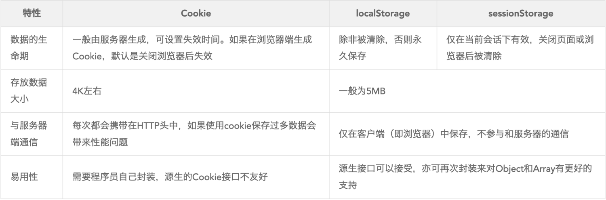

# Cookie、session、WebStorage的区别和作用

<br />
<br />Cookie、session、localStorage、sessionStorage是困扰了我很久的几个概念，一直分不清它们之前的区别与联系。这里要解释一下，localStorage和sessionStorage都是WebStorage中的API，也就是HTML5新增的浏览器本地存储API。<br />今天我们通过这篇文档来好好梳理一下。首先通过Cookie、session的区别来解读一下它们的用途。
<a name="d41d8cd9"></a>
### 
<a name="01ab1b0b"></a>
### Cookie和session的区别

- Cookie存储于客户端（浏览器），而session存储于服务器端（后台）
- Cookie的安全性相比于session较弱，用户可以分析存放在本地的Cookie并进行Cookie欺骗，考虑到安全性应该使用session
- session会在一定时间内保存在服务器上， 当访问增多时，会占用服务器资源，所以考虑到服务器性能的话，应该使用Cookie
- Cookie存储容量有限制，单个cookie保存数据不能超过4k，且很多浏览器限制一个站点最多保存20个Cookie。而Cookie，一般默认大小是1024k
- session是服务端产生的用于校验的身份标识、一般在app中通过Cookie将服务端产生的session_id传输到浏览器，并保存在本地，用于下一次请求发送。而Cookie是用来存储和传输的API，参与server-client通信过程。

了解完Cookie和session的区别以后，我们再来看下Cookie和WebStorage的区别
<a name="d41d8cd9-1"></a>
### 
<a name="09778bb4"></a>
### Cookie和WebStorage的区别

<br /><br />
<br />文档最开始我们就讲过，WebStorage分为localStorage和sessionStorage。而它们与Cookie的区别又在哪里呢。通过分析上图我们可以得知：

- Cookie可以参与http的传输过程，而WebStorage只是存储在浏览器中
- 存储大小区别：Cookie是4k、WebStorage可以达到5M甚至更大
- 数据的生命周期：Cookie默认是在关闭浏览器后失效，也可以手动设置；localStorage除非手动清除，否则永久保存、sessionStorage只有在会话期间有效，也就是关闭浏览器前有效
- 作用域区别：sessionStorage不在不同的浏览器窗口间共享，即使是同一个页面；localStorage只在所有同源窗口间共享。

比较完它们之间的差异以后，我们来看看具体的定义是什么吧！定义这块我引用的MDN的解释：
<a name="d41d8cd9-2"></a>
### 
<a name="7139633d"></a>
### HTTP Cookie 定义
HTTP Cookie（也叫Web Cookie或浏览器Cookie）是服务器发送到用户浏览器并保存在本地的一小块数据，它会在浏览器下次向同一服务器发起请求时被携带并发送到服务器上。通常，它用于告知服务器两个请求是否来自同一浏览器，如保持用户的登录状态。Cookie使基于无状态的HTTP协议记录稳定的状态信息成为了可能。<br />
<br />Cookie主要用于以下三个方面：<br />1、会话状态管理（如用户登录状态、购物车、游戏分数或其它需要记录的信息）<br />2、个性化设置（如用户自定义设置、主题等）<br />3、浏览器行为跟踪（如跟踪分析用户行为等）<br />

:::tips
要查看Cookie存储（或网页上能够使用其他的存储方式），你可以在开发者工具中启用存储查看（Storage Inspector）功能，并在存储树上选中Cookie
:::


<a name="0410bd45"></a>
#### 创建 Cookie
当服务器收到HTTP请求时，服务器可以在响应头里面添加一个`[Set-Cookie](https://developer.mozilla.org/zh-CN/docs/Web/HTTP/Headers/Set-Cookie)`选项。浏览器收到响应后通常会保存下Cookie，之后对服务器每一次请求中都通过Cookie请求头部将Cookie信息发送给服务器。另外，Cookie的过期时间、域、路径、有效期、适用站点都可以根据使用来指定。具体参数说明查看`[Set-Cookie](https://developer.mozilla.org/zh-CN/docs/Web/HTTP/Headers/Set-Cookie)`<br />

<a name="cc040f5e"></a>
#### 会话期Cookie
会话期Cookie是最简单的Cookie：浏览器关闭之后它会被自动删除，也就是说它仅在会话期内有效。会话期Cookie不需要指定过期时间(Expires)或者有效期(Max-Age)。需要注意的是， 有些浏览器提供了会话恢复功能，这种情况下即使关闭了浏览器，会话期Cookie也会被保存下来，就好像浏览器从来没有关闭一样。<br />

<a name="fb81e11f"></a>
#### 持久性Cookie
持久性Cookie一般是指定了一个特定的过期时间（expires）或有效期（Max-Age），即便是关闭浏览器，没有过过期时间，这个Cookie也有效。示例如下：<br />

```javascript
Set-Cookie: id=a3fWa; Expires=Wed, 21 Oct 2015 07:28:00 GMT;
```


<a name="80765204"></a>
#### Cookie的Secure和HttpOnly标记
标记为Secure的Cookie只应通过被HTTPS协议加密过的请求发送给服务端。但即便设置了Secure标记，敏感信息也不应该通过Cookie传输，因为Cookie有其固有的不安全性，Secure标记也无法提供确切的安全保障，从Chrome52和Firefox 52开始，不安去的站点（http：）无法使用Cookie的Secure标记<br />为避免跨域脚本（XSS）攻击，通过Javascrpt的Document.cookieAPI无法访问带HttpOnly标记的Cookie，它们只应该发送给服务端。如果包含服务端的session信息的Cookie不想被用户调用，就应该设置HttpOnly<br />

```javascript
Set-Cookie: id=a3fWa; Expires=Wed, 21 Oct 2015 07:28:00 GMT; Secure; HttpOnly
```


<a name="48efad66"></a>
#### Cookie作用域
Domain和Path标识定义了Cookie的作用域：即Cookie应该发送给哪些URL。<br />Domain标识指定了哪些主机可以接受Cookie。如果不指定，默认为当前文档的主机。如果指定了Domain。则一般包括子域名。<br />Path标识指定了主机下的哪些路径可以接受Cookie（该URL路径必须存在于请求URL中）。以字符%x2F('/')作为路径分隔符，子路径也会被匹配。<br />

<a name="e270befc"></a>
### Web Storage的概念和用法
Web Storage包含如下两种机制：

   - sessionStorage：为每一个给定的源维持一个独立的存储区域， 该存储区域在页面会话期间可用（即只要浏览器处于打开状态，包括页面重新加载和恢复）。
   - localStorage：同样的功能，但是在浏览器关闭后，然后重新打开浏览器仍然存在。

这两种机制是通过Window.sessionStorage和Window.localStorage属性使用，---调用其中任一对象会创建`[Storage](https://developer.mozilla.org/zh-CN/docs/Web/API/Storage)`对象，通过`[Storage](https://developer.mozilla.org/zh-CN/docs/Web/API/Storage)`对象，可以设置、获取和移除数据项。对于每一个源SessionStorage和localStorage使用不用的Storage对象---独立运行和控制<br />

:::tips
注意：

- 从Firefox45开始，当浏览器崩溃或重启时，每个源的存储大小将限制在10M，以避免因过度使用Web storage引起的内存问题
- 若用户[禁用第三方cookie](https://support.mozilla.org/en-US/kb/disable-third-party-cookies)，那么将不允许来自第三方IFrame对Web Storage的访问（FireFox43开始执行）
- 本地存储不同于mozStorage或[Session store API](https://developer.mozilla.org/en-US/docs/Session_store_API)
:::
<a name="d41d8cd9-3"></a>
### 
<a name="1d3cf112"></a>
### sessionStorage的概念
sessionStorage属性允许你访问一个session Storage对象。它与localStorage相似，不用之处在于localStorage里面存储的数据没有过期时间设置。而存储在sessionStorage里面的数据在页面会话结束时会被清楚。页面会话在浏览器打开期间一直保持，并且重新加载或恢复页面仍会保持原来的页面会话。在新标签或窗口打开一个页面时会在顶级浏览上下文中初始化一个新的会话，这点和sessionStorage的运行方式不同。
<a name="d41d8cd9-4"></a>
### 
<a name="7f7a909e"></a>
### localStorage的概念
只读的localStorage属性允许你访问一个`[Document](https://developer.mozilla.org/zh-CN/docs/Web/API/Document)` 源的对象`[Storage](https://developer.mozilla.org/zh-CN/docs/Web/API/Storage)`；其存储的数据能在跨浏览器会话保留。localstorage类似seesionStorage，但其区别在于：存储在localStorage的数据可以长期保留；而当页面会话结束--也就是说，当页面被关闭时，存储在sessionStorage的数据会被清除。<br />无论数据存储在sessionStorage还是localStorage中，它们都特定于页面的协议<br />localStorage中的键值对总是以字符串的形式存储。<br />​<br />
<a name="25f9c7fa"></a>
### 总结
看过这些概念以后，其实session不应该和Cookie、WebStorage放在一起比较，因为session主要作用不是存储，而是身份验证。Cookie和WebStorage都是用来存储重要信息的API。我们在日常使用过程中不光光要考虑使用性能问题还应该考虑安全性问题。由于Cookie、localStorage、sessionStorage都有可能被用户提取，所以我们在应该尽量避免使用它们来存储系统的敏感信息。还要注意代码是否存在XSS注入的风险。
