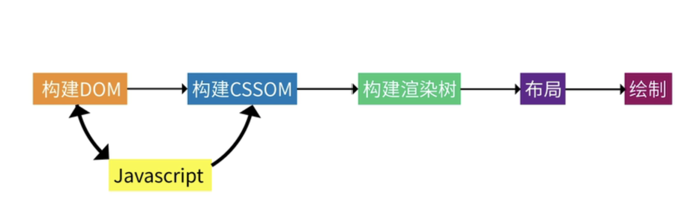

# 浏览器渲染页面过程

- 请求服务器HTML文件，并解析HTML文件
- 解析HTML文件构建DOM树，构建DOM树的过程中，遇到 `link` 标签，去请求CSS文件
- 继续解析，遇到 `script` 时，去请求JS文件，如果是同步请求JS文件或行内JS则会阻塞渲染，异步请求JS文件则会并行请求JS文件后执行（**async** 属性。立即请求文件，但不阻塞渲染引擎，而是文件加载完毕后阻塞渲染引擎并立即执行文件内容；**defer** 属性。立即请求文件，但不阻塞渲染引擎，等到解析完 HTML 之后再执行文件内容）
- 当DOM构建完以后，则需要根据请求到的CSS文件来构建CSSOM（DOM和CSSOM一起构建渲染树），JS文件内容必须等CSSOM构建完以后才能执行，由于JS可以操作DOM和CSS，所以，执行完JS以后又回重新构建渲染树和布局、绘制等

  

