# CentOS + Git + Hexo搭建个人博客

早在去年就有了搭建个人博客的冲动，碍于个人执行力太差，重度拖延症患者。把这个事一直拖到现在，这次真正付诸于行动的缘由也是脑子一热租了个服务器。还不，就自己搭个博客了。
> 需要说明的是，搭建个人博客不一定非得要一个服务器，你可以用GitHub page。在git的远程服务器上搭建自己的博客， 当然性能肯定是没自己租的服务器好的。或者虚拟主机、国外的vps之类的都可以，毕竟如果只是玩玩的话只需要一个公网ip就可以了。国内的服务器需要备案哦，如果不想备案的话就选取其它方式

## 原理
在搭建博客之前，先讲解下搭建个人博客的流程，也可以说是原理。

个人博客嘛，肯定要有一个专属于自己的域名了，所以首先需要注册一个自己的域名，然后将这个域名和你的服务器进行绑定。有了服务器和域名以后，我们需要将博客的静态文件放到服务器上，然后在服务器上搭建一个web服务器来解析你的静态文件。这样就成了。

## 所需技术介绍
我搭建的的博客是基于CentOS、Git、Hexo的，所以这里只介绍这三种技术

### CentOS
> CentOS（Community Enterprise Operating System，中文意思是社区企业操作系统）是Linux发行版之一，它是来自于Red Hat Enterprise Linux依照[开放源代码](https://baike.baidu.com/item/%E5%BC%80%E6%94%BE%E6%BA%90%E4%BB%A3%E7%A0%81/114160)规定释出的源代码所编译而成。由于出自同样的[源代码](https://baike.baidu.com/item/%E6%BA%90%E4%BB%A3%E7%A0%81/3587471)，因此有些要求高度稳定性的[服务器](https://baike.baidu.com/item/%E6%9C%8D%E5%8A%A1%E5%99%A8/100571)以CentOS替代商业版的[Red Hat](https://baike.baidu.com/item/Red%20Hat) Enterprise Linux使用。两者的不同，在于CentOS完全开源。

CentOS也就是linux操作系统的社区版，我租的服务器操作系统就是CentOS的，当前最新的是7.6。CentOS的操作我就不赘述了，因为我也不是很懂，😁

### Git
Git一个分布式的版本控制系统，一定要将Git和[GitHub](https://www.github.com)区分开哟，GitHub是专门针对git进行版本控制的代码开源和私有托管平台。你可以在GitHub中查看使用git进行操作的代码，提供了一个可视化的平台更加方便。
Git的一些建议操作，在这里介绍一下：

   1. clone：克隆，从GitHub远程仓库进行代码复制，其中会附带.git文件，该文件会记录每一次个git操作
   1. add：新增，在工作区新增的文件提交暂存区之前需要先进行新增操作
   1. rm：删除，当你在提交之前删除了文件，提交版本库时，会出现冲突，这时git status查验下已删除文件，然后进行git rm操作，再提交，解决冲突
   1. commit：暂存提交，将暂存区中的文件提交到本地版本库中
   1. push：提交远程仓库
   1. pull：从远程仓库中拉取代码

这些就是git中的一些基本操作了，如果还想了解得更加详细可以去[廖雪峰的个人网站](https://www.liaoxuefeng.com/wiki/896043488029600/898732864121440)看一下Git的专题板块

### Hexo
[Hexo](https://hexo.io/zh-cn/docs/)是一个快速、简洁且高效的博客框架。Hexo使用[Markdown](http://daringfireball.net/projects/markdown/)（或其他渲染引擎）解析文章，在几秒内就可以利用靓丽的主体生成静态网页。
Hexo是基于Node.js环境运行hexo-cli生成静态模版并使用Git进行版本控制，所以需要确保你已经安装了[Node.js](http://nodejs.org/)和
[Git](http://git-scm.com/)
Hexo可以一键生成博客静态文件，并使用hexo-cli进行一键部署。并且具有强大的插件和主体系统，这其中就有我最钟意的Next主题，简洁耐看……

## 前期准备工作

1. 首先需要去购买一个域名和云服务器，国内很多平台都可以买像阿里云、华为云、腾讯云、新浪云这些。因为每个云平台的优惠价格都会变动，所以这里就不推荐了。之前google一些教程的时候有见过一些域名服务商例如狗爹（GoDaddy）、vps服务商Vutrl这些都可以参考参考。购买服务器和域名我使用的腾讯云，因为听朋友说有校园优惠活动（最重要的是审核不严格，将就读时间填写        最近一年内），这个活动可能是腾讯的促销活动吧，可能会随时截止，如果条件允许的话，建议尽早续费，有        两次续费的机会。贴一下活动地址

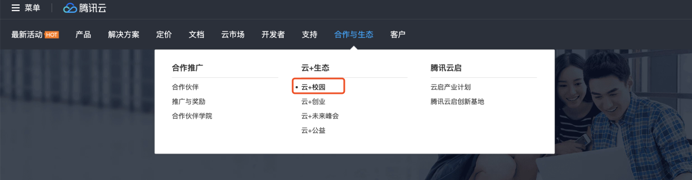

进入活动页面以后，会看到一些信息：

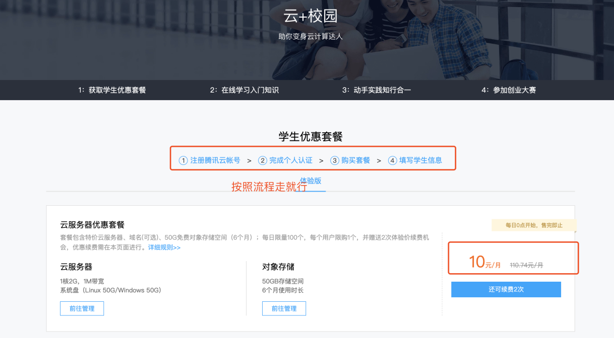

一年120可以说是很实惠了，具体的操作按照流程走就行，不需要操心配置的问题。这样服务器就搞定了
域名也可以在腾讯云里购买，贴一下域名购买的位置：

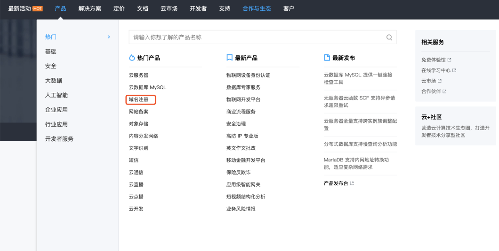

进入域名注册主页以后，可以查询准备注册的域名，看是否有人注册，如果没有的话就可以注册了

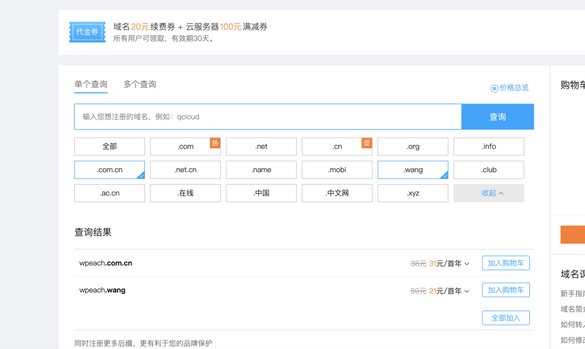

如以上所示，我查询的是wpeach，出来有.com.cn后缀和.wang的后缀的域名可以注册。如果选好了加入购物车，付款以后这个域名就是你的了。如果在腾讯云购买了云服务器的话，域名解析是免费的，动动手指就行……
云服务器购买以后有一个默认的实例，一般情况下会给你配置好，进入控制台云服务器界面看到类似一下界面就成功了

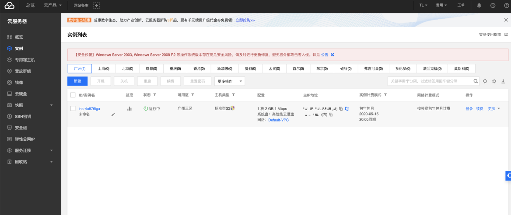

2. 本机上需要部署node.js、Git、hexo-cli（node和Git的安装可以百度一下或者google）

本机上安装好node.js和Git以后打开终端检查:

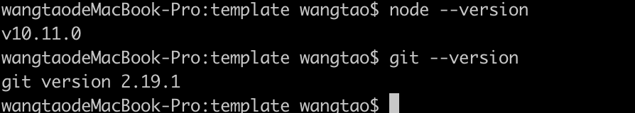

出现明确的版本好说明安装成功，如果报错了，就需要重新安装
安装好node以后就可以使用npm安装hexo了，运行命令`npm install -g hexo`，查看终端：

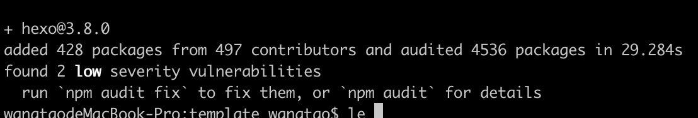

出现如下类似结果就代表安装成功了，然后运行命令`hexo --version`查看都安装了啥：

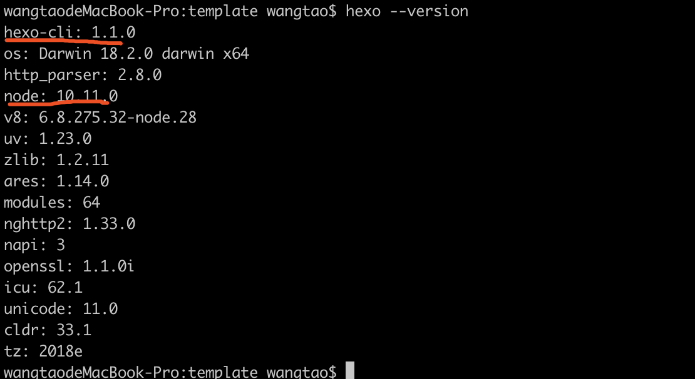

从上图中可以看到，安装了`hexo-cli`，`hexo-cli`就是下面我们将用来生成静态博客文件的工具了

3. 服务器上需要部署nginx

先下载一个服务器终端[termius](https://www.termius.com/)，然后将刚刚购买的云服务器主机配置到terminus上。安装好了以后，进入该终端：

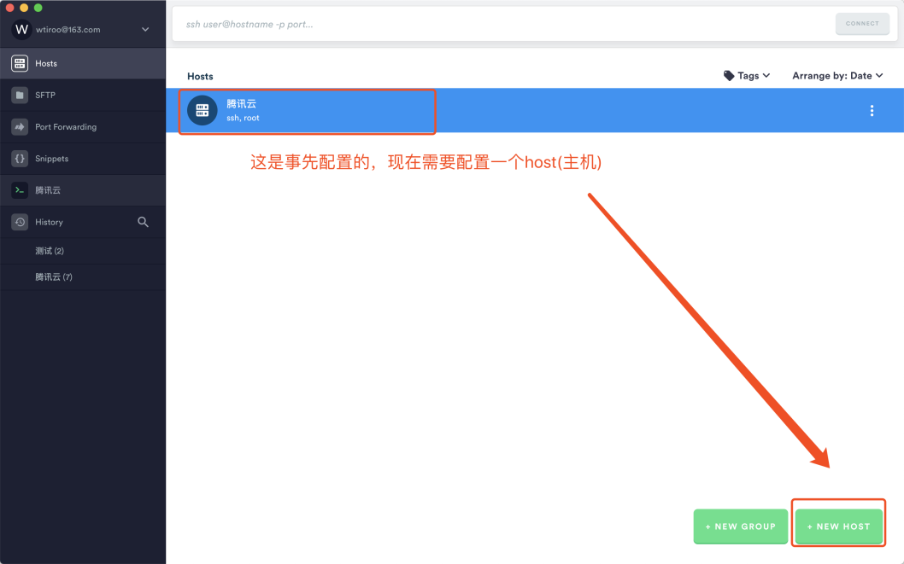

然后进行下一步：

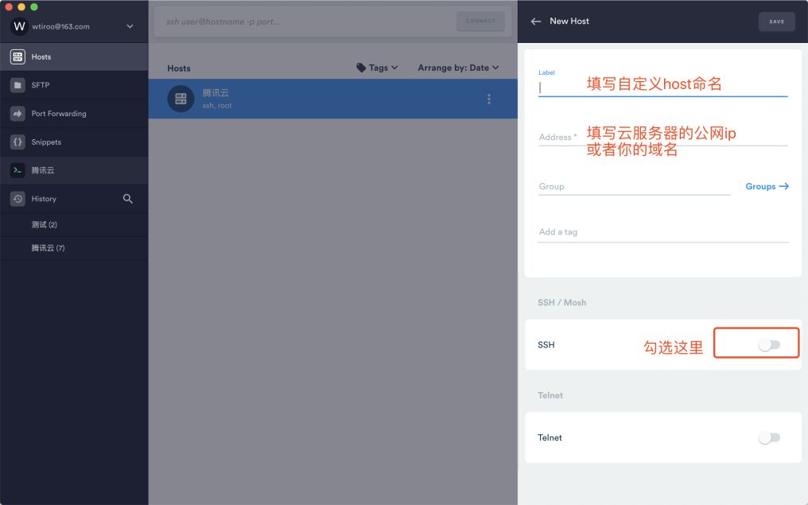

需要说明的是，这里的服务器公网ip需要进入你的云服务器控制台查看主IP地址，一定要勾选ssh才会出现下一个界面：

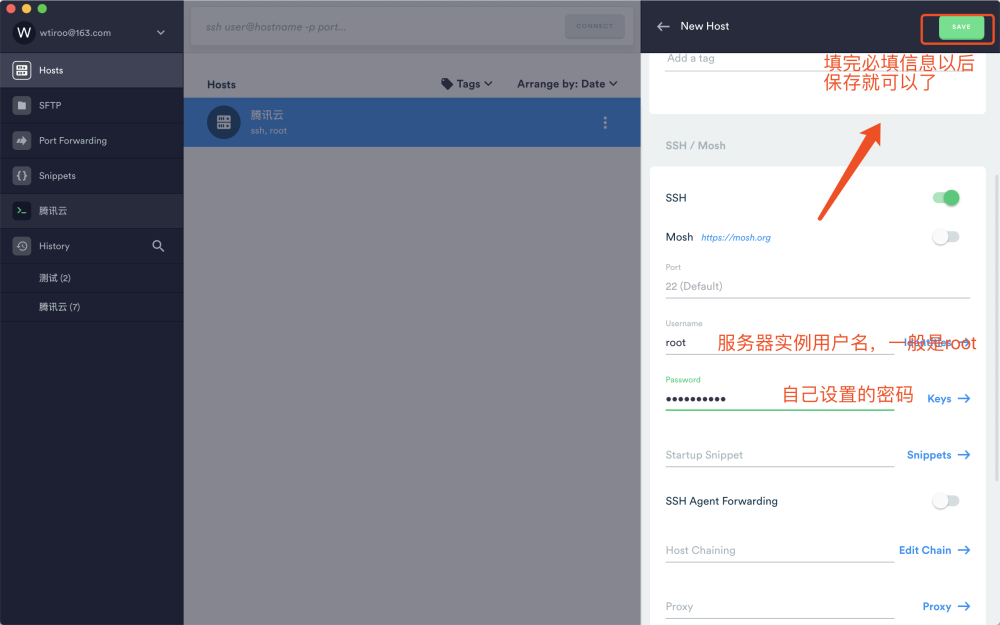

这里的用户名和密码是你在配置服务器的时候输入的用户名和密码，一定要记住。保存以后，你就看到了类似一个主机创建成功了，然后双击该主机就进入了一个终端界面：

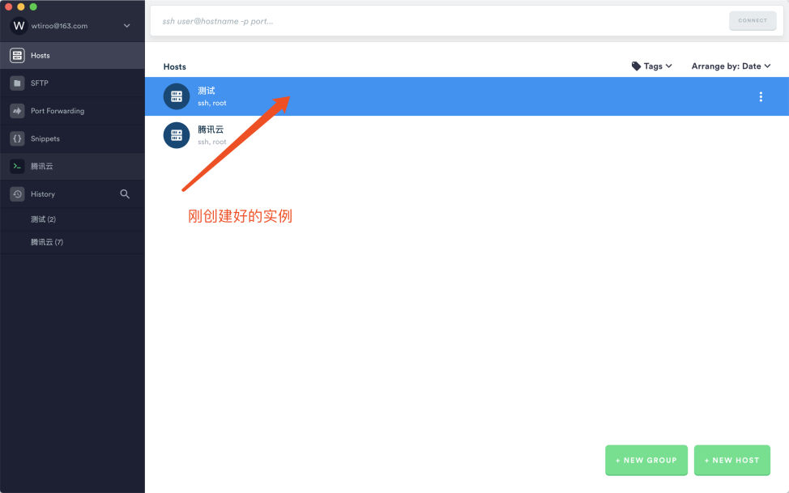

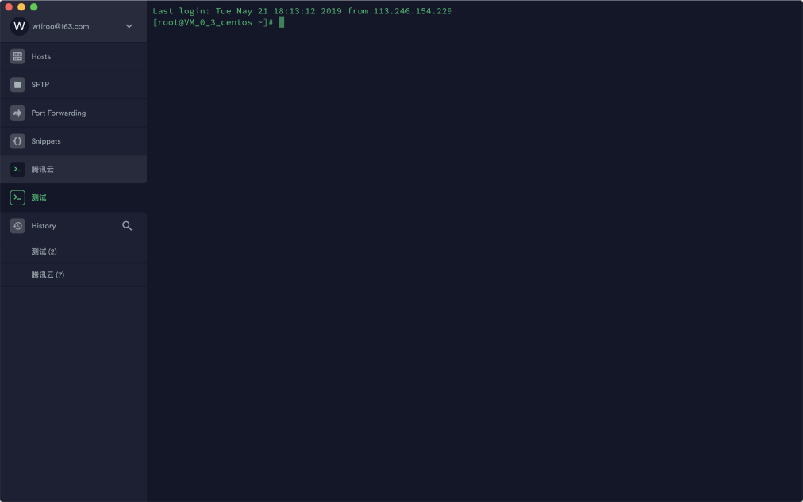

在该终端界面中默认进入主目录，如果你需要创建一个文件夹、安装一些东西之类的，就相当于在本地操作终端一样，接下里安装`nginx`，运行命令`yum -y install opensll opensll-devel`，等待终端安装，然后检查`nginx`是否安装玩好：`nginx -V`，具体结果如下：
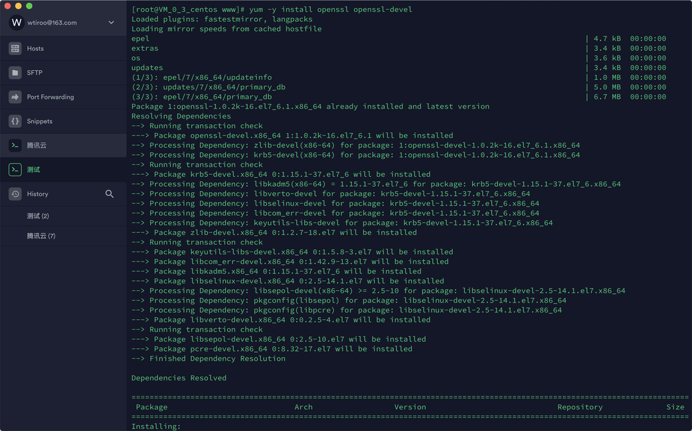

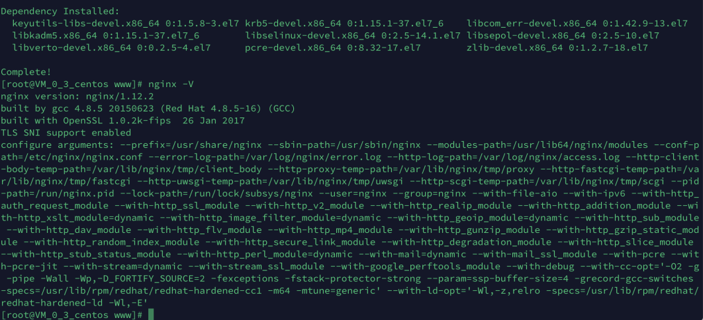

到这里nginx就安装好了～～

## 详细搭建流程
在搭建之前，先说下思路：hexo本地配置生成博客静态文件 --> 上传至GitHub远程仓库 --> 服务器拉取GitHub远程仓库代码，如下图所示：

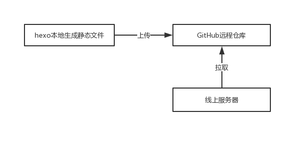

环境搭建完成以后，就可以进行具体操作了。按照图示步骤一步步进行：

### hexo本地生成静态文件
打开本机终端，新建一个文件夹，然后进入该文件夹，并使用hexo-cli新建一个项目：blog
运行命令`hexo init blog`:

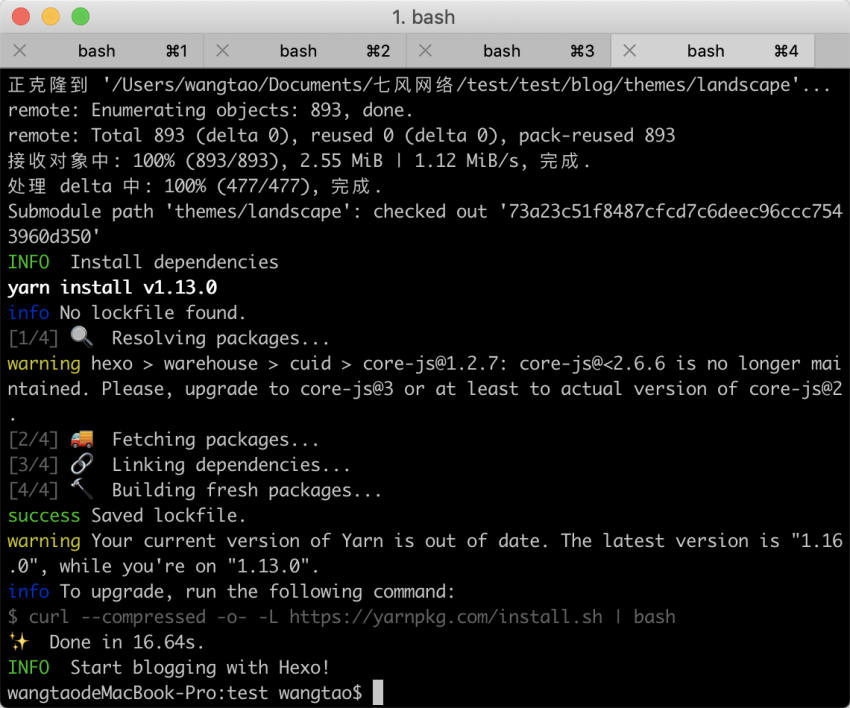

这样就新建了一个静态的博客项目了，打开这个文件，分析一下目录结构：

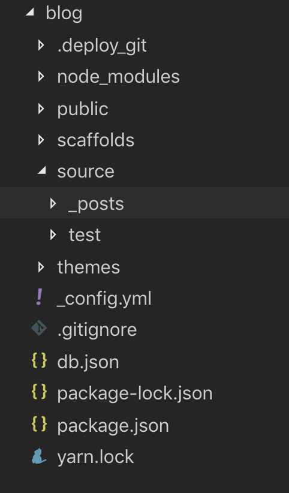

_config.yml是用来填写配置信息的， source文件夹用来存储我们的markdown文件的。当我们新建一个hexo文件时，会默认包含一个测试说明markdown，我们就用这个markdown来进行测试。运行命令：hexo g或hexo generate，会生成一个public文件夹，就是我们所需要的静态文件，感兴趣的话可以去看看详细的html。
我们可以在本地查看生成的静态文件是否正确，运行命令：`hexo server`

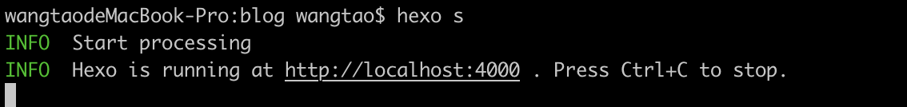

进入这上面的地址，就可以查看blog的生成效果了，一般情况下是这样的：

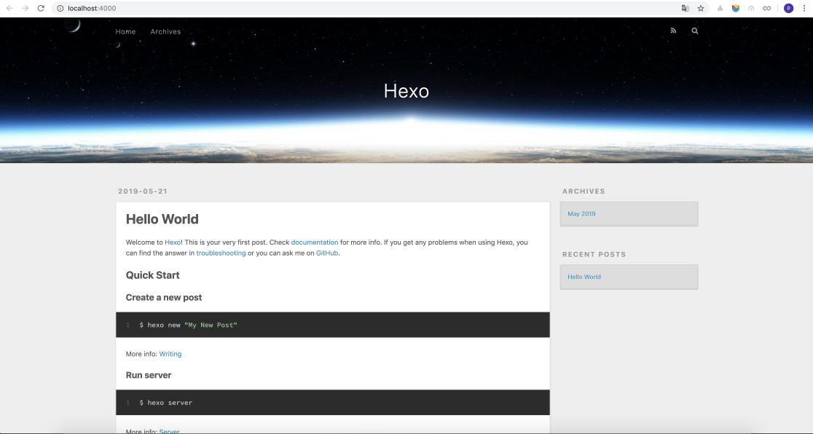

我们再来看下_config.yml文件，其中有一个地方可以用来配置我们上传的Git的远程仓库。配置文件如下：

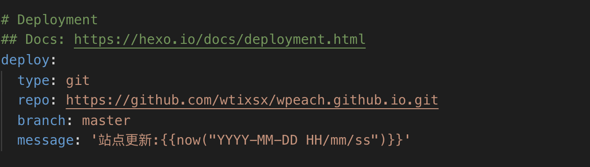

这边我使用的https的传输协议，直接去GitHub的仓库中进行复制就行了，如果你要使用SSH协议的话，可以参照我的上一篇博客[《]()[[ssh连接git远程仓库](https://www.yuque.com/wpeach/uqz90h/2019-05-17)](https://www.yuque.com/wpeach/uqz90h/2019-05-17)[》]()。配置好了以后，运行命令：`hexo deployer` 或者` hexo d`，再去GitHub上看一下，代码是否更新。

## 服务器部署，并克隆拉取Git项目
在前期的准备工作中，我们在服务器上安装了nginx，这里需要对nginx进行配置，搭建我们的web服务器。首先进入nginx的配置文件，运行命令`：vim /etc/nginx/nginx.conf`

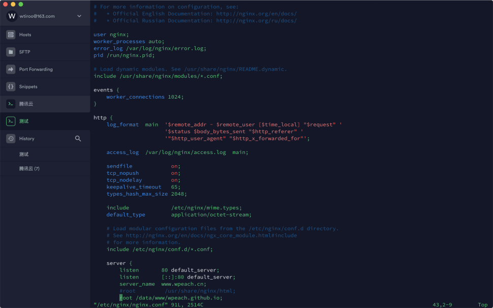

进入如下界面，这是我已经配置了的，我们需要先按i键进入编辑界面，然后配置`server_name`也就是我们之前绑定的域名或者服务器公网ip，还需要配置我们的`root`，也就是`web`服务器入口，这里需要注意的是不需要具体到`.html`文件，因为`nginx`或自动识别`index.html`为入口文件，所以这里配置你存放静态文件的路径就行了。编辑完了以后按`esc`键退出编辑，然后运行`:wq`退出此界面。然后运行命令`nginx -s load`，然后每次修改配置文件以后都要运行命令`nginx -s reload`,
接下来我们只需要将GitHub中的项目拉取到nginx中制定的文件夹中就行了。需要注意的是，nginx配置的地址要和静态文件中包含index.html的文件夹一致哦。可们可以使用命令：`git clone git@XXXXX`进行项目克隆。具体的地址需要去GitHub的远程仓库中查看，每次更新以后，在服务器目标文件夹执行命令：`git pull`就行了。因为的网站还在备案期，这里没办法贴截图出来了～～
到这里一个简单的个人博客就搭建好辣👏👏👏

## 总结
搭建博客的方式有很多，我选择hexo的原因是不用搭建数据库，而且这个库使用的是基于node.js实现的，可以运用我熟悉的知识，出现问题也比较容易去解决。这篇文章只是简单介绍了该怎么搭建，还有很多细节没有一一讲述，等日后有时间再进行补充。

现如今网上有一大堆关于自建博客的教程，我的这篇可能还算不上教程。在我看来是帮助我记忆的一个笔记。如果观看了这篇博客以后您觉得有哪里不对的话，欢迎指正。这样能督促我能写出更好的博客，帮助其他人。🙏🙏🙏

想法千万条，不如run一下————
