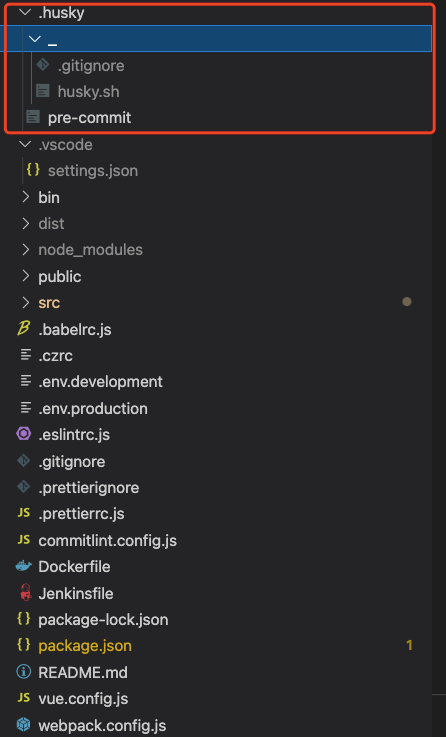
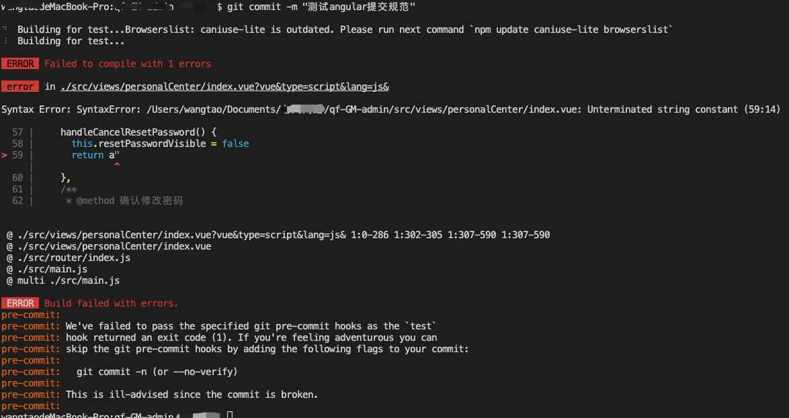
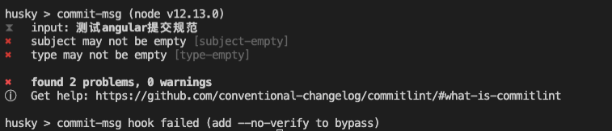
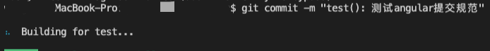
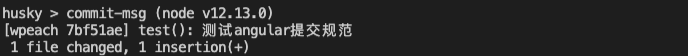

# 前端工作流之commit规范及其配置

## 为啥要规范git commit 规范?

当我们的项目体积日益增大以后，我们的 `git `提交量也会是很大的，如果这时候我们要对曾经的一次提交进行 `review` 时，通过一次次的提交记录中查看我们的历史提交，是一件很痛苦的事情，因为这些提交信息都没有进行分类，而且也不确定提交信息是否准确
<br>
<br>
而一份好的提交记录，会将每次提交的影响范围，内容，以及涉及到的 `bug `都清晰地展示出来，且格式一直，便于查找。这样对查看代码提交记录或者审查代码的人更友好，能够更好地了解项目的生命周期以及中间出现的问题
<br>
<br>
在这里简单介绍下 `angular` 规范 `commit message` 写法：

```javascript
<type>(<scope>): <subject>

// 空一行

<body>
 
// 空一行

<footer>
```

<br/>

- `header` 部分分为 `type`、`scope`、`subject`
   1. `type`：提交类型，包括【 `feat` | `fix` | `perf` | `refactor` | `test` | `revert` | `docs` | `ci` | `build` 】
   2. `scope`：表示改动的文件范围，可以写模块-文件
   3. `subject`：对这次改动的具体描述，例如：改了xxx `bug` 或者增加了 xxx 功能
- `body` 部分就是写一下更详细的描述，为可选项
- `footer` 部分表示如果你的改动是破坏性的比如你写的是插件，大版本升级，把 `API` 都改了，就需要在这里进行详细描述包括迁移说明

## 需要的工具及介绍

我打算使用 `commitlint + husky + lint-staged` 工具集来约束项目代码的提交，其中 commitlint 是用来约束 `git commit message `的，`husky `用来提供 `git pre-commit hook `做一些事情，而这里我们就是用来拦截 `git `提交信息，检测是否符合规范，然后再提交。当然在提交之前还可以进行一些其他操作，比如运行 `lint `一下项目，看是否有不合格的代码，但是每次提交前都 `lint `完整的项目，那会有点耗时，这对时间宝贵的程序员来说是不合理的，而 `lint-staged `的作用就是只 `lint `提交区的代码，这就大大的缩短了提交时间，提升效率。
<br>如果你记不住以上提交规范，可以安装 `commitizen ｜cz-conventional-changelog `，在提交中增加表情，可以通过 `git-cz `实现
<br>​
<br>

### 工具安装和配置
首先安装一波 `commitlint + husky + lint-staged `工具集，使用npm下载依赖的同学可以使用以下命令：
```bash
npm i husky@4.3.8 lint-staged @commitlint/cli @commitlint/config-conventional --dev
```
使用yarn的同学，使用以下命令：
```bash
yarn add husky@4.3.8 lint-staged @commitlint/cli @commitlint/config-conventional -D
```
> 由于husky6+版本存在比较大的改动，有可能存在不触发 pre-commit 的情况，所以在这里我使用相对稳定的v4.3.8
> lint-staged依赖需要运行在node v12.13.0+，所以如果安装后lint-satged报错，就需要将您的node版本升级到12.13.0或更高的版本，如果您需要多node环境切换的话，可以通过[nvm](https://www.runoob.com/w3cnote/nvm-manager-node-versions.html)工具操作

需要注意的是，对于commitlint不需要自定义提交规范的，可以直接下载 `@commitlint/config-angular` 依赖代替
<br>`@commitlint/config-conventional `依赖，关于 `angular` 提交规范可以参考：[AngularJS团队规范](https://github.com/angular/angular.js/blob/master/DEVELOPERS.md#-git-commit-guidelines)   
<br>对于大多数项目来说，`angular `团队规范应该是够用的，如果需要自定义的话，除了需要安装以上依赖以外，还需要在项目的根目录下新增` commitlint.config.js `文件，文件内容可以参考如下内容：

```javascript
module.exports = {
  extends: ['@commitlint/config-conventional'],
  rules: {
    'type-enum': [2, 'always', [
      'feat', // 新功能（feature）
      'fix', // 修补bug
      'perf', // 优化 (包括功能、性能优化)
      'docs', // 文档（documentation）
      'style', // 格式（不影响代码运行的变动）
      'refactor', // 重构（即不是新增功能，也不是修改bug的代码变动）
      'test', // 增加测试
      'revert', // 回滚
      'ci', // 构建过程或辅助工具的变动
      'chore' // 其他改动
    ]
    ],
    'type-empty': [2, 'never'],
    'subject-empty': [2, 'never'],
    'subject-full-stop': [0, 'never'],
    'subject-case': [0, 'never']
  }
}
```

也可以使用命令行添加此文件：

```bash
echo "module.exports = {extends: ['@commitlint/config-conventional']};" > commitlint.config.js
```

这种方式添加的文件内容不完整，还需要手动添加一些项，参考上述文件 `commitlint.config.js`
<br>下载完husky后还需要进行初始化，输入以下命令：

```bash
npx install husky
npm set-script prepare "husky install"
```

运行完以后，项目根目录下就会出现一个 `.husky` 文件夹，里面就是 `hook shell` ，如图所示：
<br>
<br>接下来我们修改 `.husky` 目录下的 `pre-commit` 文件，如下所示：

```json
#!/bin/sh
. "$(dirname "$0")/_/husky.sh"

npx lint-staged
```

相应的page.json我们也需要配置一下，在 `script` 中配置` lint `运行时：

```json
"scripts": {
    "serve": "vue-cli-service serve --open",
    "build": "vue-cli-service build",
    "lint": "eslint . --ext .js,.jsx,.ts,.tsx",
 }
```

在根节点下，添加` husky` 和 `lint-staged` 属性：

```json
"husky": {
    "hooks": {
      "pre-commit": "lint-staged",
      "commit-msg": "commitlint -E HUSKY_GIT_PARAMS"
    }
  },
"lint-staged": {
    "*.{js,vue}": [
      "eslint --fix",
      "git add"
    ]
 }
```

这时候，我们进行一下简单的测试，首先故意写一个错误的代码，添加并提交：
<br>
<br>项目会进行 `lint` 出错了，这时提交失败了，我们再尝试一个提交正确的代码，但是输入不规范的` git  commit message`
<br>
<br>这里出现了 `husky` 校验提交信息错误，我们再按照标准的提交方式提交
<br>
<br>
<br>这次就提交成功了！
<br>有的同学可能到这里出现husky还是无法触发的情况，可以尝试命令行：

```bash
npx husky add .husky/commit-msg 'npx --no-install commitlint --edit $1'
```

到这里我们就配置了一个的完整监控 `commit` 规范的环境，当然还有更加完善的方案，比如上面提到的增加 commitizen 进行commit 提示，以及 git-cz 添加表情，这块配置我就不赘述了，想了解的同学可以参考：
<br>[commit规范+commitlint+CHANGELOG自动生成一条龙服务](https://juejin.cn/post/6934292467160514567#heading-7)

### 总结
通过配置这套工具，我就可以方便地找到以前的垃圾代码，进行优化或者重构。经过这波配置，让我感受到前端工具的强大，以及前端生态中的有一批大佬为解放生产力而默默耕耘，生命在于折腾，我希望以后自己也能出个类似的工具，造福有需要的人，在前端圈发光发热🤩🤩
<br>​
<br>
