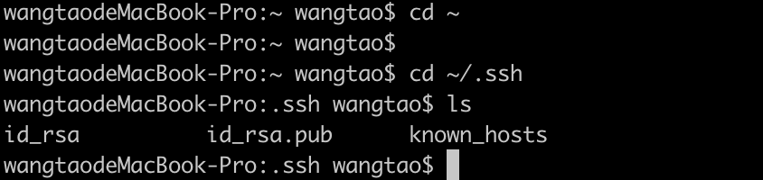
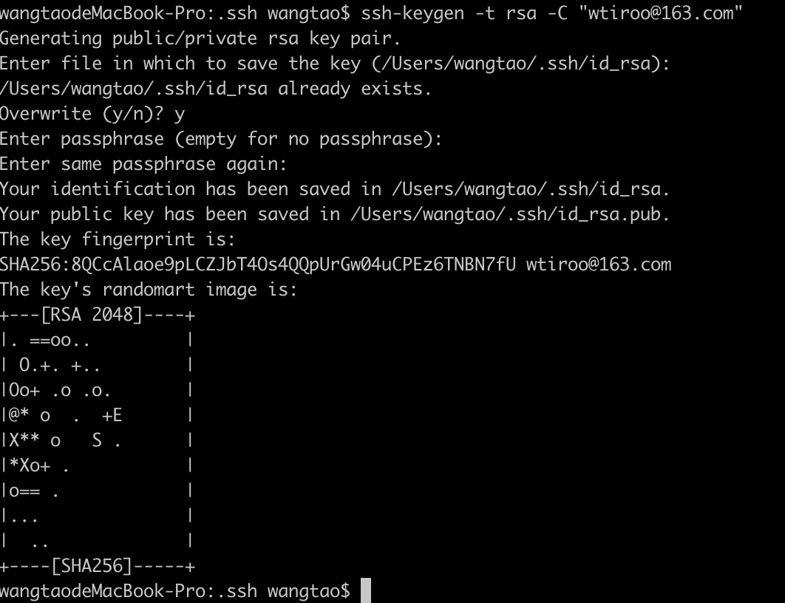
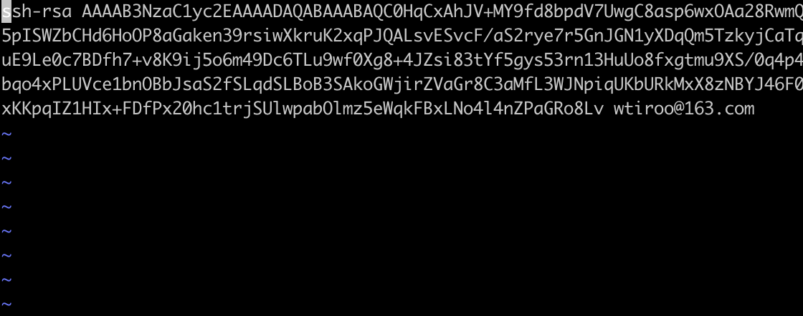
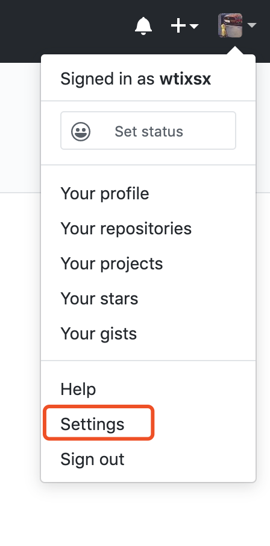
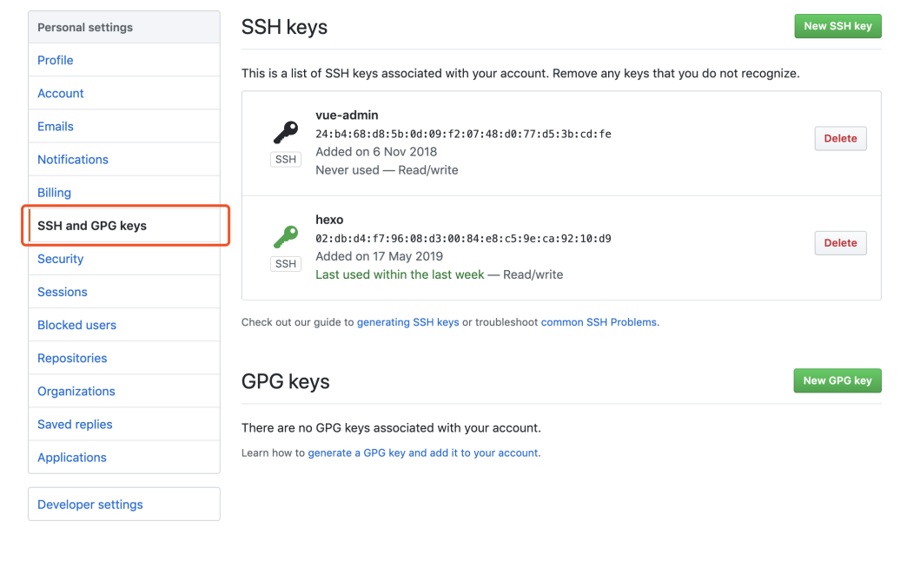
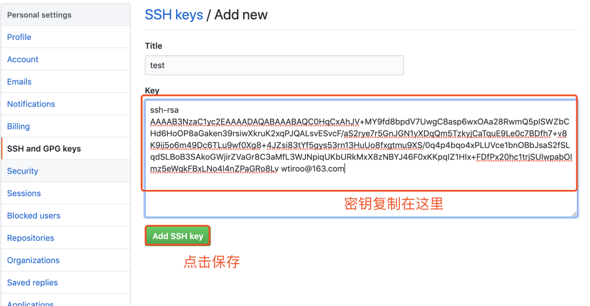
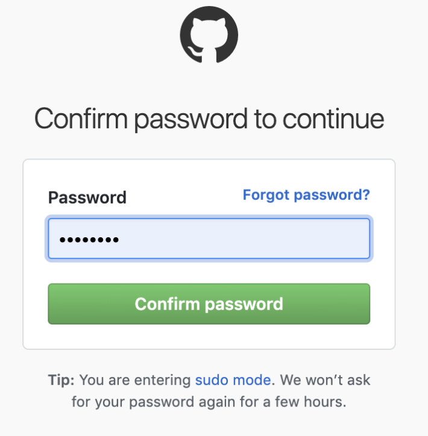
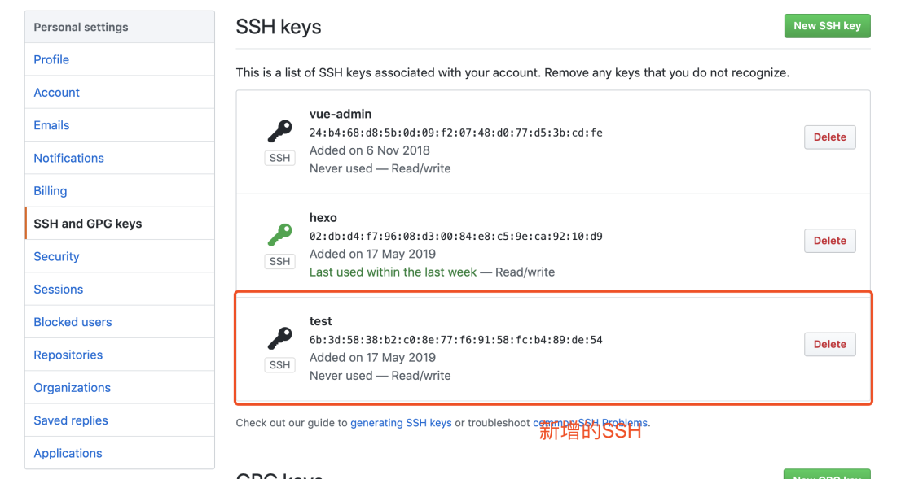
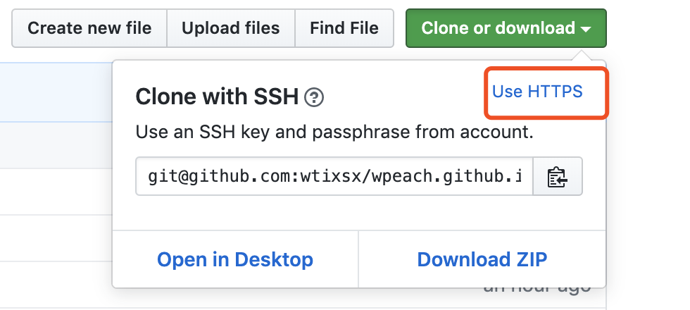

# SSH连接git远程仓库

首先说下SSH是个啥，为啥要用SSH连接git远程仓库
SSH是一个应用层的通讯协议，类似与http，也就是在客户端和服务端之间建立会话，用来传输文件和信息。

SSH是一种非对称加密的通讯协议，非对称加密的发送和接收需要使用两个密钥，这两个密钥是关联的，一个叫做公钥（Public Key）， 一个叫做私钥（Private Key）
公钥可以共享给其他人，仅仅持有公钥是无法到处私钥的。SSH从安全性和性能两方面综合考虑，结合使用了Public Key和Secure Key

Public Key：非对称加密，安全，但效率低，不适合大规模进行数据的加密和解密操作.
> SSH在一下几个节点采用了非对称加密，首先是一开始建立用于连接的对称加密时的密钥对称过程(Key exchange)；其次是广为人知的SSH身份验证过程.SSH密钥对用于让服务器验证一个客户端的身份.密钥对在客户端上生成，其中的公钥上传至远程服务器，保存在～/.authorized_keys的文件里.

Secret Key：对称解密，高效，但安全性相对较低，Key的分发尤其方便
SSH使用对称密钥为整个连接过程加密

## SSH身份验证过程
SSH连接git远程仓库也就是进行SSH身份验证。首先要在客户端生成一个SSH密钥，步骤如下：

1. 打开终端进去用户主目录，查看是否存在.ssh文件，如果存在，进入.ssh文件下查看是否存在id_rsa和id_rsa.pub文件。查看方法如下图所示：

图1-1 

如果存在以上情况则直接进入下一步，如果不存在则需要创建SSH Key：
> ssh-keygen -t rsa -C "youremail@example.com"

上述的youremial@example.com是填你自己的邮箱，别按照例子来哦，回车一个回遇到一个选项，接着回车，连续三次回车以后不出意外会生成一个密钥如下图所示：

图1-2

如果生成类似这个界面，那恭喜你的SSH密钥就生成成功了，再使用图1-1中的命令进行查看，确保已经生成。
其中id_rsa是私钥不能泄露出去，id_rsa.pub是公钥可以随便使用，git远程仓库也是需要这个公钥.

2. 进入id_rsa.pub将你的公钥copy下来，后面要用，集体操作如下图所示：
允许命令：vim ~/.ssh/id_rsa.pub，就可以看到公钥了，copy下来

图1-3

输入命令`:wq`退出此界面

3. 登录github，添加SSH密钥信息
如果没有github账户的话，注册一个就行了，然后登录github，进去以后，主界面有个小头像，点击一下，如下图所示：

图1-4

进入设置界面，然后点击侧边了的SSH and GPF Keys，进入如下界面，点击New SSH Key，新建一个SSH
密钥，如下图所示：

图1-5

点击新建SSH以后会进入如下界面，把放copy下来的公钥复制进去，随意设置一个名字保存就行了。

图1-6
保存以后会叫你输入git账号的密码进行确认，输入你的密码就行了：

 
图1-7

确认密码以后就进入了SSH的列表页，里面存在你之前新增的SSH就说明成功了，如下图所示：

图1-8

到这里我们进完成了git远程仓库和本地仓库的SSH连接了，接下来就可以随意进行git操作了。

## 总结
其实github会提供两种协议用来传输代码，一种是http协议，另一种是SSH，我们为什么要用SSH呢，因为SSH更安全，而且在服务器上进行git操作，如果用http拷贝代码下来，每次push和pull都要输入用户名和密码，这是件很麻烦的事，也占用了我们的时间。对于攻城狮来说，避免重复劳动是件很爽的事。
有个小细节，我之前没注意，这里记录一下～～～

图1-9
如图1-9中，点击这个Use HTTPS和Use SSH下面就会输出对应的地址。方便用户进行copy。
这篇文章主要是针对linux用户来的，window的操作跟这个类似，可能有些命令不太一样，等下次有时间再去操作一下😁
