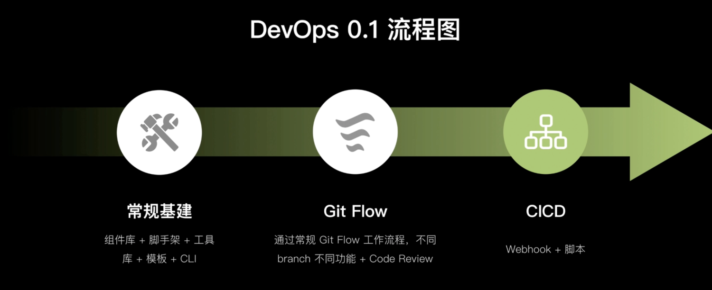
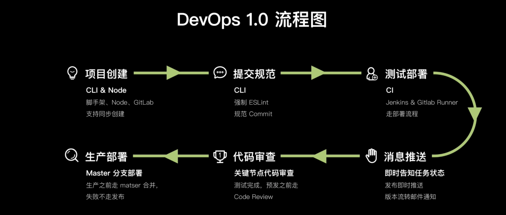
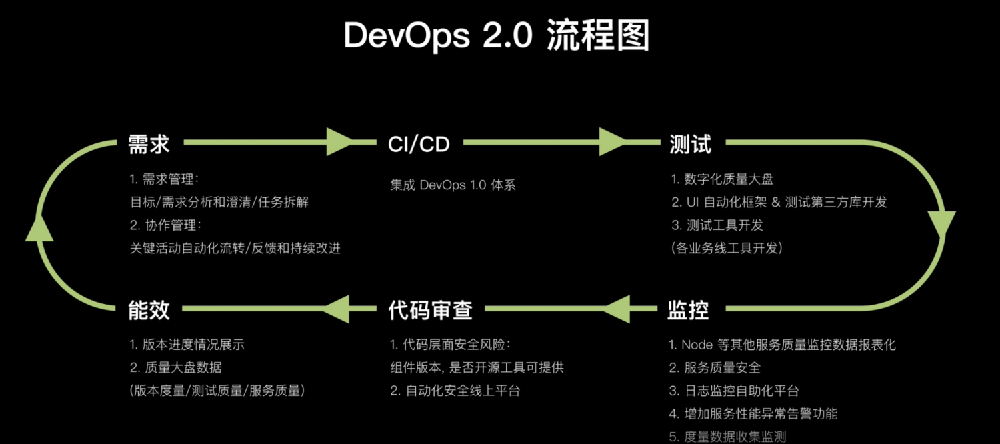

# 早早聊之如何基于Node做DevOps实践视频总结

## DevOps使用的意义
开发遇到的问题：

- **规范（代码随心所欲、人手一套脚手架，甚至无脚手架）**
- **流程（没有流程、口口相传）**
- **效率（重复的工作不断做、重复轮子反复造）**
- **质量（代码检查全靠看、功能测试全靠点）**
- **部署（人工打包，部署、线上问题后知后觉）**

当前端项目团队日益壮大的同时，可能产生很多类似环境配置、代码规范、代码上线前出错等等问题，这时候一个严格规范的开发环境配置就可以减少90%的低级错误，并显著提效

## DevOps定义

### DevOps v0.1 （3~5人团队）
常规基建 => Git Flow => CI/CD

### DevOps v1.0 （10人左右团队）
项目创建 => 提交规范 => 测试部署 => 消息推送 => 代码审查 => 生产部署

### DevOps v2.0 （20人以上团队）
需求 => CI/CD => 测试 => 监控 => 代码审查 => 能效

## Node在DevOps作用
Node用来串联DevOps各模块
​
## 工具推荐
Sentry：集中式日志管理系统

* 多项目，多用户
* 界面友好
* 可以配置异常规则
* 支持主流语言

Sonar：代码质量监测工具
