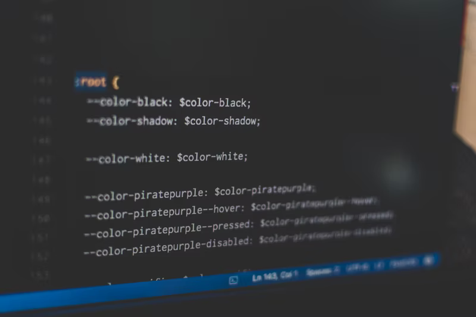
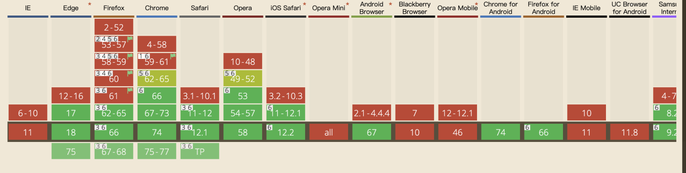
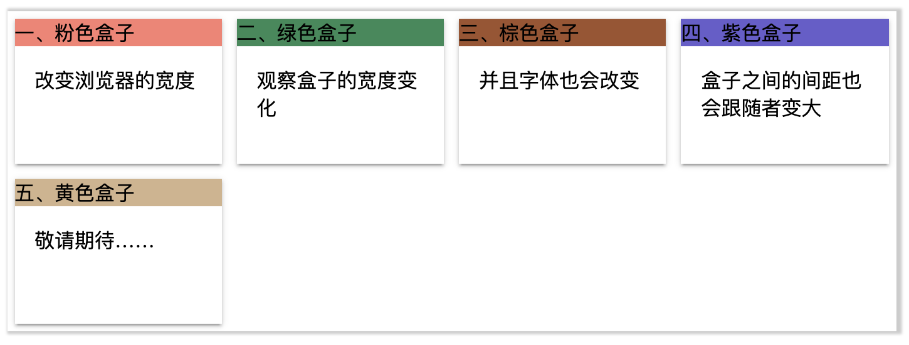
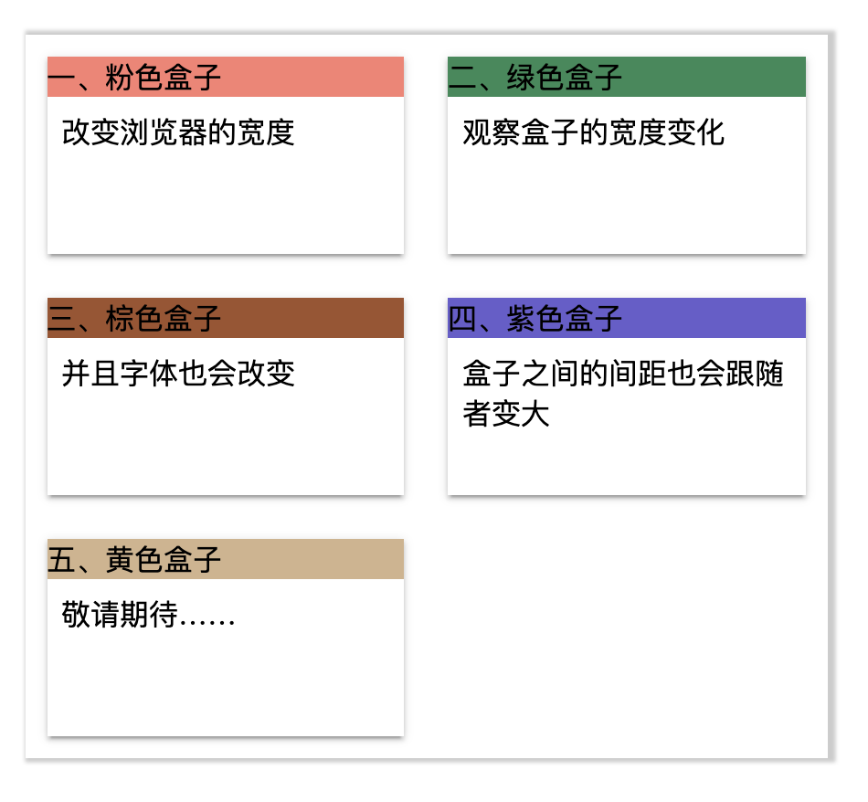

# css Variable(css原生变量var)

<br />​

最近在做javascript30的练习中碰到一个比较陌生的知识点: css Variable，也就是css 原生变量。<br />如果你已经了解了这方面的知识，那可以跳过。通过一番搜索，我找到了[张鑫旭大神的博客](https://www.zhangxinxu.com/wordpress/2016/11/css-css3-variables-var/comment-page-1/)。张大大对于这部分的知识讲解的很细。所以我就厚脸皮的摘抄下大大的内容吧。<br />

<a name="mJSwX"></a>
### 1. 兼容性
首先我们去[caniuse](https://caniuse.com/#search=variable)去查下var得兼容性：<br />
<br /><br />
<br />从图中可以看到，主流浏览器都兼容此属性，但是IE和QQ、baidu浏览器是不支持得。如果你的应用要兼容这些浏览器，可能var不是一个好的选择。<br />

<a name="IVnkw"></a>
### 2. css变量var()语法的用法和特性
css中原生的变量定义语法是：`--*`，变量使用语法是：`var(--*)`，其中`*`表示我们的变量名称。<br />关于命名这个东西，各种语言都有些显示，例如css选择器不能是数字开头，js中的变量是不能直接是数值的。但是在css中没有这些限制。例如：<br />

```css
:root {
  --1: #333;
}
body {
	background-color: var(--1);
}
```

<br />背景色如下：<br />
<br /><br />
<br />但是不能包含`$ 、[ 、^ 、( 、%`等字符，普通字符局限在只要是数字`"[0-9]"`字母`"[a-zA-Z]"`下划线`"_"`和短横线`"-"`这些组合，但是可以是中文、日文、或者韩文，例如：<br />

```css
:root {
	--ㅈㅇ: orange;
}
body {
	background: var(--ㅈㅇ);
}
```

<br />背景色如下：<br />
<br /><br />
<br />如上述例子所示，使用韩文作为变量依旧好使。所以使用中文肯定没问题，在命名方面，同学们使用起来应该没有任何压力的。<br />
<br />无论是变量的定义和使用只能在声明块{}里面, 例如下面这样是无效的：<br />

```css
--红色: red;
body {
	background: var(--红色);
}
```

<br />变量的定义，或者说声明跟css计数器的声明类似的，你应该摆脱sass/less等预编译工具语法先入为主的语法影响，把css的原生变量理解为一种css属性。<br />
<br />这样，你就对其权重和变量应用规则要容易理解得多。<br />
<br />例如下面这个例子：<br />

```css
:root { --color: purple; }
div { --color: green; }
#alert { --color: red; }
* { color: var(--color); }

<p>我的紫色继承于跟元素</p>
<div>我的绿色来自直接设置</div>
<div id="alert">
	ID选择器权重更高，所以我显示红色
	<p>我也是红色，占了继承的光</p>
</div>
```

<br />上面这个例子中，我们可以了解到：<br />1、变量也是跟着`CSS`选择器走的， 如果变量所在的选择器和使用变量的元素没有交集，是没有效果的。例如`#alert`定义的变量，只有`id`为`alert`的元素才能享有。如果你想变量全局使用，则你可以设置在`:root`选择器上<br />2、当存在多个同样名称的变量时候，变量的覆盖规则由`CSS`选择器的权重决定的，但并无`!important`这种用法，因为没有必要，`!important`设计初衷是干掉`JS`的`style`设置，但是对于变量的定义则没有这样的需求。<br />

<a name="WUHKh"></a>
### 3. CSS属性可以使用变量定义吗？
类似这样：<br />

```css
body {
	--bg: background-color;
  var(--br): #333;
}
```

<br />显然这样是不行的，如果可以这样使用的话，那css的压缩就无敌了，基本所有的css属性都可以压缩到1～2个字符<br />

<a name="8Nt3s"></a>
### 4. CSS变量使用的完整语法

<br />CSS变量使用的完整语法为：` var([, ]?)`，用中文表达就是：`var(<自定义属性名>[, <默认值]?)`，<br />意思就是，如果我们使用的变量没有定义(注意，仅限于没有定义)，则使用后面的值作为元素的属性值。举个例子：<br />

```css
div {
	--红色: red;
}
body {
	background: var(--红色, #cdcdcd);
}
```

<br />此时的背景色是`#cdcdcd`：<br />
<br /><br />
<br />CSS变量不合法的缺省特性<br />请看下面的这个例子：<br />  
```css
body {
	--color: 20px;
  background-color: #369;
  background-color: var(--color, #cd0000);
}
```

<br />请问，此时body的背景色为？<br />

```
A. #369   B. 20px   C. #cd0000  D.transparent;
```

<br />答案是：………………………………D. transparent<br />
<br />这是CSS变量非常有意思的一点，对于CSS变量，只要语法是正确的，就算变量里面的值是乱七八糟的东西，也是会作为正常的声明解析，如果发现变量值是不合法的，例如上面的背景色显然不能是`20px`，则使用背景色的缺省值。也就是默认值代替，于是，上面的CSS等同于：<br />

```css
body {
	--color: 20px;
  background-color: #369;
  background-color: transparent;
}
```


<a name="2y8jC"></a>
### 5. CSS的空格尾随特性
请看下面这个例子：<br />

```css
body {
	--size: 20;
  font-size: var(--size)px;
}
```
  <br />请问，此时的`<body>`的`font-size`大小是多少？<br />
<br />我想大多数人会以为是`20px`吧，其实不然。此处的`font-size: var(--size)px`别解析出来是`font-size: 20 px`;注意，20的后面会有一个空格，所以，这里的`font-sizes`使用的是`<body>`元素默认的大小。因此，就不要妄图取消就使用一个数值来贯穿全场，还是使用稳妥的做法：<br />

```css
body {
	--size: 20px;
  font-size: var(--size);
}
```

<br />或者使用CSS3的`calc()`计算：<br />

```css
body {
	--size: 20;
  font-size: calc(var(--size) * 1px);
}
```

<br />此时的`<body>`的`font-size`大小才是`20px`<br />

<a name="35IYv"></a>
### 6. CSS变量的相互传递特性

<br />就是说，我们在CSS变量定义的时候可以直接引入其他变量给自己用，例如：<br />

```css
body {
	--green: #4CAF50;
  --backgroundColor: var(--green);
}
```

<br />或者更复杂的CSS3`calc()`计算，例如:<br />

```css
body {
	--column: 4;
  --margins: calc(24px/ var(--column));
}
```

<br />对于复杂布局，CSS变量的这种相互传递的直接引用的特性可以简化我们代码和实现成本，尤其和动态布局在一起的时候，无论是CSS的响应式后者是JS驱动布局的变化。<br />
<br />我们来看一个CSS变量与响应式布局的例子，您可以狠狠地戳这里：[CSS变量与响应式布局示例DEMO](https://www.zhangxinxu.com/study/201611/css-var-media-query-layout.html)<br />
<br />默认进去是四栏，如下图：<br />​

<br />​

这里直接引用张大大的资源了，在demo中，随着浏览器的宽度减小，4栏可能就变成3栏，2栏甚至1栏。我们实际开发过程中，显然不仅仅是栏目数量变化，宽度小，往往意味着访问设备尺寸有限，此时我们往往会缩小空白间距以及文字字号大小。这样，有限屏幕才能显示更多内容。<br />​

也就是说，当我们响应式变化的时候，改变的CSS属性值不止一个，如果我们有三个响应点，是不是就至少需要9个CSS声明？但是，由于我们有了CSS变量，同事，CSS变量可以传递，当我们遭遇响应点的时候，我们只需要改变一个CSS属性值就可以了。<br />​

下面就是本demo核心CSS代码（只需要改变--colum这个变量即可）<br />

```css
.box {
	--column: 4;
  --margin: calc(24px / var(--column));
  --space: calc(4px * var(--column));
  --fontSize: calc(20px - 4 / var(--column));
}
@medium screen and (max-width: 1200px) {
  .box {
  	--column: 3;
  }
}

@medium screen and (max-width: 900px) {
  .box {
  	--column: 2;
  }
}

@medium screen and (max-width: 600px) {
  .box {
  	--column: 1;
  }
}
```

<br />于是，我们在2栏下看到的效果就是这样了。字号，间距随着栏目数量的减少也一并减少了一半，然后咩栏之间的间距是扩大了。<br />
<br /><br />
<br />这样看来是不是感觉很方便呢？<br />

<a name="fU2c3"></a>
### 7. 总结
张大大这篇博文写得可以说是非常详细了，基本每个使用的点都有介绍到。虽然我没去看标准是怎么介绍这块的内容的，但是张大大博文中的每个点我都有测试。<br />值得提一下的是：原生CSS的变量如果所有浏览器都可以支持的话，那么基本可以替代sass/less的功能了。
