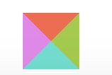
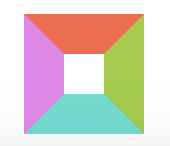
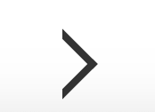

# HTML5+CSS3实现箭头

<br />
<br />用DIV+CSS3实现的箭头形式有两种：一种是实心箭头，一种是线箭头。<br />在讲实现实心箭头之前，先讲一下用border实现一个多颜色矩形<br />

```css
<style>
	.rectangle {
    width: 0;
    height: 0;
    border: 20px solid;
    border-top-color: tomato;
    border-bottom-color: turquoise;
    border-left-color: violet;
    border-right-color: yellowgreen;
  }
</style>
<div class="rectangle"></div>
```

<br /><div style="text-align: center;">

</div>
<br />如图，将宽高设置为0，利用border的样式将一个矩形分为四个三角形。如果将其中三个方向的border颜色设为透明则可以得到一个三角形。给div设置一个小于border宽高的宽高就可以得到一个中空盒子<br />

```css
<style>
	.trangle {
  	width: 0;
    height: 0;
    border: 20px solid transparent;
    border-left-color: violet;
  }
	.hollow-box {
  	width: 20px;
    height: 20px;
    border: 20px solid;
    border-top-color: tomato;
    border-bottom-color: turquoise;
    border-left-color: violet;
    border-right-color: yellowgreen;
  }
</style>
<div class="trangle"></div>
<div class="hollow-box"><div>
```

<br /><div style="text-align: center;"> </div><br />
<br />通过这两个图的变换，应该可以看出一点东西，就是一个div的布局中，border的填充是通过将div分成等分的四个三角形，所以要实现规则的图形，通过一些css的变换就可以实现<br />而三角线箭头是通过css的变换实现的，原理很简单，就是通过一个有宽高的边框进行旋转就行了，话不多说看代码<br />

```css
<style>
  .arrow {
  	width: 20px;
    height: 20px;
    border: 4px solid transparent;
    border-top-color: #333;
    border-right-color: #333;
    transform: rotate(45deg); // css3的变换需要考虑兼容性问题
  } 
 </style>
<div class="arrow"></div>
```

<br /><div style="text-align: center;"></div><br />
<br />还有一种通过伪元素的定位去实现的，这种方法存在伪元素的位置不好确定，可能跟业务场景下的颜色冲突，这种方案不推荐，实现方案还是贴一下<br />

```css
<style>
 .arrow {
 	position: relative;
  left: 100px; top: -100px;
  width: 20px;
  height: 20px;
  overflow: hidden;
  background-color: #FFF;
 }
.arrow::before {
	display: block;
  content: '';
  position: absolute;
  top: 4px;
  width: 25px;
  height: 40px;
  border: 4px solid #333;
  transform: rotate(45deg); // css3的属性需要考虑兼容性
}
 </style>
<div class="arrow"></div>
```

<br /><div style="text-align: center;"></div><br />
<br />这种方法不推荐，还有很多实现箭头的方式，菜鸟总结，大神勿喷！有好的想法，可以交流一下哦～～
