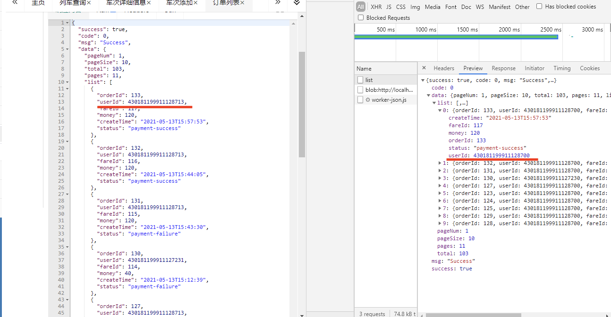
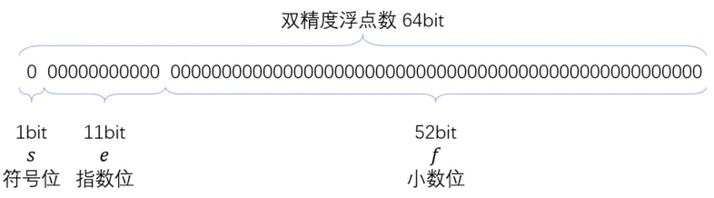
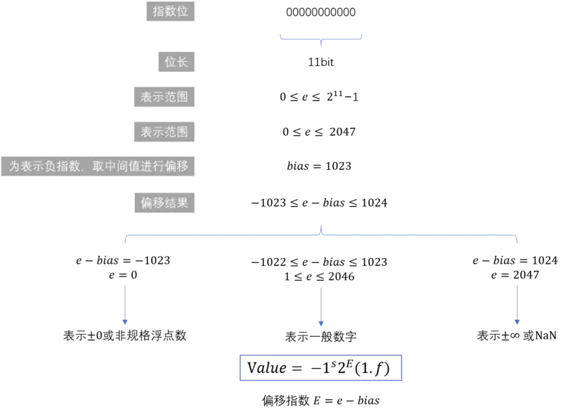

# 🤯 javaScript数字丢失精度问题

最近在一个后台管理项目中出现一个有趣的事情：当我们展示一个服务端传来的超长数字标识时发现，展示的结果和数据库存储的数据不一致，并且chrome控制台Network面板中获取的数字也和数据库存储的不一致。这我就很纳闷呐，还有这种操作？看波截图：
<br><br>

<br><br>
碰到这种问题赶紧脑补一个搜索关键词，简单的百度一下，搜出一堆结果，排查了一下，结果是个老问题了（javaScript数字精度丢失问题）。经常看面经的同学应该对`0.1 + 0.2 !== 0.3` 很熟悉吧。那既然碰到了，我们就来总结一波，以防下次碰到类似的问题一脸懵🤮。

## JS数字精度丢失的一些典型问题

### 1、两个简单的浮点数运算
这种问题就是我们看到的经典面试题`0.1 + 0.2 !== 0.3` ，除此之外还有：
```javascript
1 / 3; // 0.3333333333333333
-0.09 - 0.01; // -0.09999999999999999
0.012345 * 0.000001; // 1.2344999999999999e-8
0.000001 / 0.0001; // 0.009999999999999998
```

### 2、大整数运算
当我们的整数长度超过一定数值时也会出现失去精度的问题，就比如我今天遇到的问题，还有一些其他情况：
```javascript
9999999999999999 == 10000000000000001; // true
var x = Math.pow(2, 53);
x + 1 === x // true
```

### 3、toFixed方法四舍五入错误（chrome）
当使用toFixed方法进行四舍五入时也有可能出现一些不可思议的情况（小数位尾数为5时四舍五入出错）：
```javascript
Number(1.335).toFixed(2); // 1.33
Number(162.295).toFixed(2); // 162.29
```

## JS数字丢失精度的原因
通过查找资料我们了解到，javaScript的Number类型是采用浮点数标识的，并规定使用 IEEE 754Q1 标准的双精度浮点数表示。所以当javaScript存储数值时需要先把十进制数转换成二进制的科学计数法的形式，然后计算机以自己的规则【 符号位 + （指数位 + 指数偏移量的二进制） + 小数位 】Q2  存储，由于存储时有位数限制（64位），并且某些十进制的浮点数在转换为二进制数时会出现无限循环，造成二进制进行舍入操作（0舍1入），当再转换成十进制时就出现了计算误差。
Q1：IEEE 754是美国IEEE（电器及电子工程师协会）提出的一个从系统角度支持浮点数的表示方法，当今流行的的计算机几乎都是采用了这一标准。
IEEE 754规定了两种基本浮点格式：单精度和双精度

   - 单精度浮点数在内存中占4个字节、有效数8位、表示范围：-3.40E+38 ~ 3.40E+38
   - 双精度浮点数在内存中占8个字节、有效数字16位、表示范围：-1.79E+308 ~ 1.79E+308

Q2：双精度浮点数图解

> 符号位：1 表示正数、0表示负数
> 指数位：规定使用e+指数偏移量，得到的结果再转化成二进制，就是我们的指数位值。其中e为科学计数法中的幂值e，可为正数，也可以为负数
> 小数位：表示精确的数值，总数52位，不够位数用0补齐，小数位前有一个隐藏位默认值1，所以JS中能精准表示的最大整数为Math.pow(2, 53) = 9007199254740992，可以使用Nu​mber.MAX_SAFE_INTEGER + 1验证

指数位可以通过下面的方式转换成使用的指数值：
<br>
<br>

科学计数法公式：X = a * 2e （其中1 =< a < 2，e为小数点移动的位数，正值右移，负值左移）。
指数偏移量：指数量偏移公式   
X = 2k-1
> k为指数位个数（如上图所示，双精度浮点数的指数为11，套用公式即X = 211 - 1 = 1023）
> 所以双精度浮点数的指数偏移量都为1023

总结一下双精度浮点数的处理方式：

1. 将目标数转换成二进制数
1. 再将二进制数转为科学计数法表达式得到十进制指数位再转化成二进制数，去除因数首位得到小数位
1. 按照【符号位（1） + 指数位（11） + 小数位（52）】的方式拼接进制数，需要注意的是，科学计数法的因数a中的首位1就是双精度浮点数小数位的隐藏位数1

---

举例：

1. 我们将16.5转换成二进制数（十进制整数转二进制采用“除2取余，逆序排列”，十进制小数转二进制小数采用“乘2取整，顺序排列”），得到1000.1
1. 转换成科学计数法：1.0001 *  23 ，指数位为3 + 1023 = 102610 = 100000000102 ，小数位为0001 补够52位为：0001000000000000000000000000000000000000000000000000
1. 按照双精度浮点数的规则进行拼接得到：1 + 10000000010 + 0001000000000000000000000000000000000000000000000000

通过上面这种方式，我们来推算一下问题的原因：

- `0.1 + 0.2 !== 0.3`

`0.1 >>> 0.0001 1001 1001 1001...（1001无限循环）`
`0.2 >>> 0.0011 0011 0011 0011...（0011无限循环）`
`0.1 + 0.2 >> 0.0100 1100 1100 1100...（1100无限循环）`
转换成十进制后就变成了0.30000000000000004

- 大整数运算失准是因为双精度浮点数能表示的最大整数为Math.pow(2, 53) = 9007199254740992，当超过这个数时就会出现丢失精度的情况。
- toFixed()对于小数最后一位为5时，进位不正确的问题是，因为当最后一位为5时，可能实际的数小于5，拿`1.005`举例，`1.005.toPrecision(21) = ``1.00499999999999989342` 。后面的值在四舍五入时被舍去了，所以造成了这样的错误


## 解决方案
对于整数，JS出错只发生在大整数运算丢失精度，只要运算结果不超过Math.pow(2, 53)一般不会出现丢失精度的情况。如果超出了整数边界，我们给出提醒
对于小数，出现问题的概率比较大，所以我们经常把小数转变成整数后进行运算，然后将运算结果除以扩大的倍数得出结果
而对于数据的精准展示，我们可以写一个方法来进行处理：
```javascript
function strip(num, precision = 12) {	
	return +parseFloat(Number(num).toPrecision(precision));
};
strip(1.40000000000001); // 1.4
```
小数运算的方法采用扩缩法，解决思路可以通过小数点的位置来计算需要扩大的倍数，两个数的倍数取较大的那个，运算以后，再除以倍数得出结果，根据这个思路我们来整一个解决方案：
```javascript
/*
 * @method strip 正确表示数据的值
 * @param {number} num 处理值
 * @param {precision} 处理精度
 */
function strip (num, precision = 12) {
	return +parseFloat(Number(num).toPrecision(precision));
};

/*
 * @method digitLength 获取有效值的长度(兼容科学计数法取值)
 * @param {number} num 处理值
 */
function digitLength (num) {
	const eSplit = num.toString().split(/[eE]/i);
  const len = (eSplit[0].split('.')[1] || '').length - +(eSplit[1] || 0);
  return len > 0 ? len : 0;
};

/*
 * @method floatToInt 把小数扩大成整数，支持科学计数法
 * @param {number} num 处理值
 */
function floatToInt (num) {
	if (num.toString().indexOf('e') === -1) {
  	return Number(num.toString().replace('.', ''));
  }
  const digLen = digitLength(num);
  return digLen > 0 ? (Number(num) * Math.pow(10, digLen)) : Number(num);
};

/*
 * @method checkBoundary 检查数字是否越界，如果越界给出提示
 * @param {Number} num 处理值
 */
function checkBoundary (num) {
	if (num > Number.MAX_SAFE_INTERGER || num < Number.MIN_SAFE_INTERGER) {
  	console.error(num + '已经超过数值运算的极限，当进行运算时有丢失精度的风险！');
  }
};

/*
 * @method multiple 精准乘法
 * @param {Number} num1 运算参数1
 * @param {Number} num2 运算参数2
 */
function multiple (num1, num2) {
	const int1 = floatToInt(num1);
  const int2 = floatToInt(num2);
  const baseNum = digitLength(num1) + digitLength(num2);
  const products = int1 * int2;
  
  checkBoundary(products);
  
  return products / Math.pow(10, baseNum);
};

/*
 * @method add 精准加法
 * @param {Number} num1 运算参数1
 * @param {Number} num2 运算参数2
 */
function add (num1, num2) {
  const maxBase = Math.pow(10, Math.max(digitLength(num1), digitLength(num2)));
  return (multiple(num1, maxBase) + multiple(num2, maxBase)) / maxBase;
};

/*
 * @method subtract 精准减法
 * @param {Number} num1 运算参数1
 * @param {Number} num2 运算参数2
 */
function subtract (num1, num2) {
  const maxBase = Math.pow(10, Math.max(digitLength(num1), digitLength(num2)));
  return (multiple(num1, maxBase) - multiple(num2, maxBase)) / maxBase;
};

/*
 * @method devide 精准除法
 * @param {Number} num1 运算参数1
 * @param {Number} num2 运算参数2
 */
function devide (num1, num2) {
	const int1 = floatToInt(num1);
  const int2 = floatToInt(num2);
  
  checkBoundary(int1);
  checkBoundary(int2);
  
  return multiple(int1 / int2, strip(Math.pow(10, digitLength(num2) - digitLength(num1))));
};

/*
 * @method round 精准四舍五入
 * @param {Number} num 处理值
 * @param {Number} ratio 取值精度
 */
function round (num, ratio) {
	const base = Math.pow(10, ratio);
  return devide(Math.round(multiple(num, base)), base);
};
```

## 引用
【1】 古兰精  [JavaScript数字精度丢失问题总结](https://www.cnblogs.com/goloving/p/7712742.html)
<br>
【2】 自由的囚徒 [js精度丢失问题-看这篇文章就够了(通俗易懂)](https://zhuanlan.zhihu.com/p/100353781)
<br>
【3】 ksfkf [IEEE 754标准](https://www.jianshu.com/p/7c636d8f18d5)
<br>
【4】 菜鸟教程 [十进制数转换成二进制数](https://www.runoob.com/w3cnote/decimal-decimals-are-converted-to-binary-fractions.html)
<br>
【5】 nefe [number-precision](https://github.com/nefe/number-precision/blob/master/src/index.ts)
