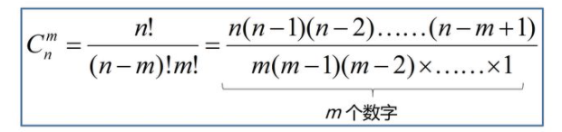
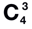

# 奇淫技巧之“01转换法”实现组合

最近在leetcode上看到一道关于组合的题，原题是这样的：
> 给定两个整数n和k，返回1...n中所有可能的k个数的组合。
> 示例：
> `输入:` n = 4, k = 2
> <br>`输出:`
> [
> <br>&nbsp;&nbsp;[2,4],
> <br>&nbsp;&nbsp;[3,4],
> <br>&nbsp;&nbsp;[2,3],
> <br>&nbsp;&nbsp;[1,2],
> <br>&nbsp;&nbsp;[1,3],
> <br>&nbsp;&nbsp;[1,4],
> <br>]

不知道各位看官对此题有什么样的思考呢？

## 组合的定义


组合，英文是Combination，因此在数学符号中用C表示，美国和英国教材中，也长哟哦那个“长括号表”表示组合数。
我们通过来表示一个组合，这表示`从一个还有m个数的集合中，```不计顺序```的抽取出包含m个数的集合的抽数法`，组合的数学表达式及其解法如下图所示：

当前我们关注的不是组合后结果的总数，而是如何使用javaScript实现一个实现组合的函数，并罗列出所有可能的集合。


## “01转换法”实现组合


如果我们有一个数组`['a', 'b', 'c', 'd']`，从其中4取3组成一个数组。我们使用穷举法可以列举出所有的可能性，通过数学公式可以计算出 = 4，但是当我们把基数放大时，就没办法通过穷举法来罗列出所有的可能性，需要我们找出一个规律来计算出所有的组合。这时候我们不妨把这个组合看成是一个只包含`“0”`和`“1”`的数组，`“0”`代表当前位置不被选中，`“1”`代表当前位置被选中，这样我们就能得到一系列的代表选中位置坐标的集合，用上面的例子来类比：
```javascript
[1, 1, 1, 0] // ['a', 'b', 'c']
[1, 1, 0, 1] // ['a', 'b', 'd']
[1, 0, 1, 1] // ['a', 'c', 'd']
[0, 1, 1, 1] // ['b', 'c', 'd']
```
我们再来总结下该怎么处理这样的一个01组合，数组可能不太好操作，我们不妨把数组转换成字符串来进行替换操作后再转成数组。所以我们完整的`“01转换法”`步骤如下所示：

1. 创建一个由“0”和“1”组成的数组，长度为n，数组中`“1”表示其下标所在的数被选中，为“0”则没被选中`
1. 初始化该数组，将数组中前m个元素置为`“1”，`表示第一个组合为前n个数
1. 然后从左到右扫描数组元素值的`“10”`组合，找到`第一个“10”组合后替换成“01”`
1. `同时将第一个“10”组合下标前的所有“1”移到最左边`
1. `当n个“1”全部移动到最右端时，即字符串中没有“10”组合后，遍历结束，得到最后一个组合`

首先按照这个逻辑我们先实现所有“1”和“0”组合的数组：
```javascript
/`
 * @method getFlagArr 获取所有可能10组合
 * @param {Number} n 集合总数
 * @param {Number} m 抽取数
 */
function getFlagArr(n, m = 1) {
	if (m < 1 || m > n) return [];
  
  let index;
  let temp = '1'.repeat(m) + ('0').repeat(n - m);
  const arr = [Array.from(temp, x => Number(x))];
  const flag = '10';
  
  while (temp.includes(flag)) {
  	index = temp.indexOf(flag);
    temp = temp.replace(flag, '01');
    temp = Array.from(temp.slice(0, index)).sort((a, b) => b - a).join('') + temp.slice(index)
    arr.push(Array.from(temp, x => Number(x)));
  }
  
  return arr;
};

getFlagArr(5, 3); // Array(10)
// 0: (5) [1, 1, 1, 0, 0]
// 1: (5) [1, 1, 0, 1, 0]
// 2: (5) [1, 0, 1, 1, 0]
// 3: (5) [0, 1, 1, 1, 0]
// 4: (5) [1, 1, 0, 0, 1]
// 5: (5) [1, 0, 1, 0, 1]
// 6: (5) [0, 1, 1, 0, 1]
// 7: (5) [1, 0, 0, 1, 1]
// 8: (5) [0, 1, 0, 1, 1]
// 9: (5) [0, 0, 1, 1, 1]
```
有了上面的函数，组合问题就很好实现了，只需要根据1和0的位置来确定取到的元素集合，我们来实现一下：
```javascript
/`
 * @method combine 组合
 * @param {Array} targetArr 目标数组
 * @param {Number} num 抽取数
 */
function combine(targetArr, num) {
	if (!Array.isArray(targetArr) || (num < 1 || num > targetArr.length)) return [];
  
  const arr = [];
  
  const flagArr = getFlagArr(targetArr.length, num);
  
  while (flagArr.length) {
  	const temp = flagArr.shift();
    // 根据下标筛选出目标数组中的选中元素
    arr.push(targetArr.filter((item, index) => temp[index]));
  }
  
  return arr;
};

combine(['a', 'b', 'c', 'd'], 3)
// (4) [Array(3), Array(3), Array(3), Array(3)]
// 0: (3) ["a", "b", "c"]
// 1: (3) ["a", "b", "d"]
// 2: (3) ["a", "c", "d"]
// 3: (3) ["b", "c", "d"]
```
看到这里你学废了吗，当然对于组合问题还有更多的解法，可以去[leetcode](https://leetcode-cn.com/problems/combinations/)查看详细的题解🐶～～


## 引用
【1】浣熊数学 [如何同属的解释排列公式和组合公式的含义？](https://www.zhihu.com/question/26094736)
【2】摄氏零度 [关于组合算法的JS实现](http://jimyuan.github.io/blog/2019/04/03/combination-algorithm-with-js.html)
