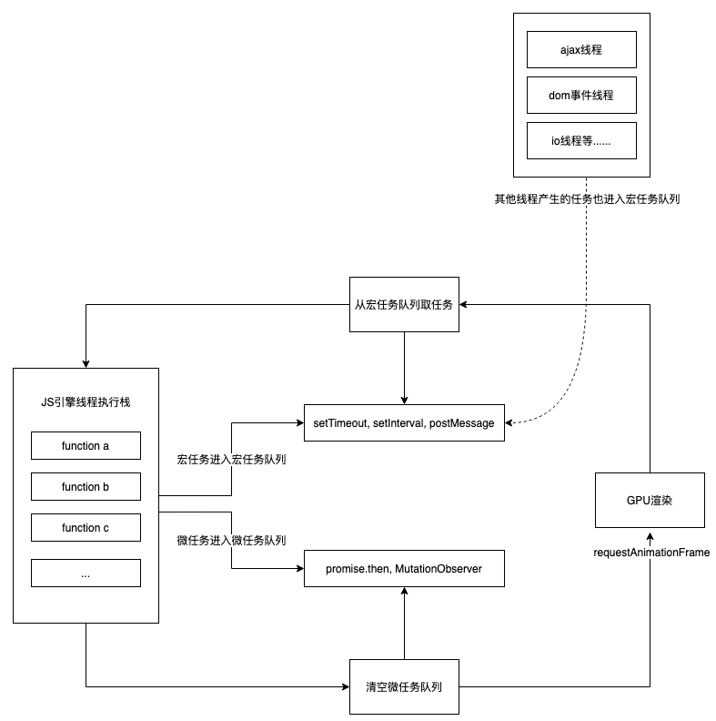

# 一文搞懂宏任务、微任务、消息队列、事件循环

## 为什么要搞懂这些概念？
总所周知，JavaScript是一门单线程、异步、非阻塞、解析类型的脚本语言<br />JavaScript的设计就是为了处理浏览器网页的交互（DOM操作、UI动画等）。当主线程在解析HTML生成DOM树的过程中会执行style、layout、render以及compisite的操作，而JS可以操作DOM，CSSOM，这会影响到主线程在解析HTML的最终渲染结果，最终页面的渲染结果将变得不可预见，这也决定了它是一门单线程语言。<br />当遇到定时器、DOM事件监听或者AJAX请求时，JS会将这些任务暂存起来，等到同步任务执行完毕之后再来执行这些任务。这些异步任务的执行顺序就成了一个问题。而JavaScript巧妙的通过事件循环（event Loop）机制来解决了这个问题。
需要说明的是，本文所有内容都是基于浏览器环境<br />

## 定义

### 消息队列
消息队列是浏览器用来暂存异步任务的执行队列，等待JS引擎到合适的时机取出调用（满足先进先出的原则）

### 事件循环
JS引擎执行事件操作的一种机制，其规则是：
JS的主线程每次只能同时执行一个任务，所以线程会优先执行同步任务，每次执行完所有的同步任务后再检查消息队列中是否存在微任务；如果微任务队列不为空时，则先执行完所有的微任务，再执行下一次的宏任务；当微任务队列为空时，则判断是否需要进行页面渲染（重排），如果需要则进行页面渲染；如果不需要则进行下次循环，直到执行完所有的任务队列

### 宏任务
浏览器中可以用来执行异步任务的方法，其主要有：

   - **`<script>`执行代码**
   - **setTimeout**
   - **setInterval**
   - **setImmediate**
   - **requestAnimationFrame（属于页面渲染过程，微任务执行完之后执行）**
   - **I/O操作**
   - **UI rendering**

### 微任务
同样是浏览器中用来执行异步任务的方法，其主要有：

   - **process.nextTick**
   - **promise.then/promise.catch**
   - **Object.observe**
   - **MutationObserver**


## 浏览器事件循环的执行顺序

1. **按顺序执行用户代码`<script>`中的所有同步代码**
1. **执行完所有同步代码后且执行栈为空，判断是否有微任务需要执行**
1. **执行所有微任务且微任务队列为空**
1. **是否需要渲染页面**
1. **执行一个宏任务**

具体执行步骤如下图所示：<br /><br />需要注意的是宏任务队列是可以有多个的，微任务队列只能有一个，但是定时器、I/O操作的宏任务是放到一个宏任务队列的。如果出现多个宏任务队列，应该如何取宏任务呢？这个是比较灵活的，不同的浏览器解析机制不同，规范里没做限制，但是只要保证以下两点即可：

- **相同来源的宏任务都放到一个宏任务队列中**
- **每个宏任务队列都是按照先进先出的顺序取出**


## 代码示例
看了这么多概念，我们再来整一些栗子测试下是否搞懂了这些概念，先来个同步任务、宏任务、微任务混合的小栗子：
```javascript
function foo() {
    console.log('foo');
}
function bar() {
    setTimeout(foo);
    console.log('bar');
}
function baz() {
    setTimeout(() => console.log('baz'));
}
function liz() {
    requestAnimationFrame(() => console.log('liz'));
}
function rep() {
    Promise.resolve().then(() => console.log('rep'));
}
console.log('start');
foo();
bar();
baz();
liz();
rep();
console.log('end');
```
上面这个示例的答案是：`start`，`foo`，`bar`，`end`，`rep`，`liz`，`foo`，`baz`。（safari浏览器除外，其解析机制不同）<br />如果你得出的结论和这不一致，那就要认真看下下面的解析了：

   1. 首先按照循序执行所有的同步任务，依次输出`start` 、`foo`
   1. 执行到bar函数时，遇到了一个setTimeout，属于宏任务，先压入宏任务队列，然后输出`bar` ，并接着往下执行
   1. baz函数中又存在一个setTimeout，同样属于宏任务，压入宏任务队列，往下执行
   1. liz函数中存在一个requestAnimationFrame函数，这个方法虽然属于宏任务，但是他属于UI渲染方法，应该排在宏任务之前执行
   1. req函数中定义了一个Promise，其中的then方法回调属于微任务，压入微任务队列，继续执行
   1. 输出`end`，此时所有的同步任务都执行完成
   1. 开始查询微任务队列是否为空，很显然不为空，所以执行微任务，输出`req`
   1. 微任务队列此时为空，查看是否需要页面渲染，上面有一个requestAnimationFrame触发了页面渲染，所以执行该方法的回调函数，输出`liz`
   1. 页面渲染完成，开始查询宏任务队列
   1. 按照先进先出的顺序执行宏任务，依次输出`foo`、`baz`


<br />接下来再看一个在**微任务中创建微任务**的🌰：

```javascript
setTimeout(() => console.log('setTimeout5'))
new Promise(resolve => {
	resolve()
  console.log('Promise1')
}).then(() => {
	console.log('Promise2')
  Promise.resolve().then(() => {
  	console.log('Promise3')
  }).then(() => {
  	Promise.resolve().then(() => {
    	console.log('Promise4')
    })
  })
})
console.log('end')
```

示例结果是：`Promise1`、`end`、`Promise2`、`Promise3`、`Promise4`、`setTimeout5`<br />同样的，我们来分析下这段代码的执行顺序：

   1. 首先出现一个setTimeout，那就将其回调函数压入宏任务队列，等待执行
   1. 接着初始化了一个Promise，Promise中的回调函数属于同步任务，所以先输出`Promise1`
   1. Promise的then方法回调属于微任务，所以将其压入微任务队列，等待执行
   1. 执行到代码最后一行执行打印语句，输出`end`，到这里同步任务就都执行完了
   1. 开始查询微任务队列是否为空，此时不为空，按照先进先出的原则一次执行微任务，先输出`Promise2`
   1. 然后又执行了一个Promise.resolve().then(）直接将其回调函数压入微任务队列，其后的then方法回调同样压入队列
   1. 继续轮询微任务队列，此时微任务队列仍然有任务，按照先进先出的原则，取出刚刚的微任务，输出`Promise3`
   1. 继续执行下一个微任务，此时又执行了Promise.resolve().then()，所以继续将其压入微任务队列
   1. 继续轮询微任务队列，执行最后一个微任务，输出`Promise4`
   1. 此时微任务都执行完了，再查看是否需要渲染页面，显然不需要，那就执行宏任务，输出`setTimeout5`，这一轮事件循环结束


<br />
**微任务中创建宏任务**的🌰：

```javascript
new Promise((resolve) => {
	console.log('new Promise(macro task 1)');
  resolve();
}).then(() => {
	console.log('micro task 1');
  setTimeout(() => {
  	console.log('setTimeout1');
  }, 0)
})

setTimeout(() => {
	console.log('setTimeout2');
}, 500)

console.log('end');
```

示例的结果是：`new Promise(macro task 1)`、`end`、`micro task 1`、`setTimeout1`、`setTimeout2`<br />我们对🌰进行一个分析：

   1. 首先我们初始化一个Promise，里面的回调函数属于同步任务先执行，输出`new Promise(macro task 1)`
   1. 然后执行到.then方法，将其压入微任务队列，然后接着执行下面的代码
   1. 遇到包含打印"setTimeout2"的定时器，将其压入宏任务队列
   1. 执行最后一行同步打印语句，输出`end`
   1. 同步任务执行完，开始执行微任务，取出队列的第一个任务，开始执行，输出`micro task 1`，然后碰到一个包含打印"setTimeout1"的定时器，将其压入宏任务队列
   1. 微任务执行完，查看是否需要渲染页面，此时不需要
   1. 开始执行宏任务，第一个压入队列的是setTimeout2，但是他的延时是500ms，所以先将其回调函数加入消息队列，等执行空闲以后，延迟500ms执行
   1. 接着执行第二个宏任务，setTimeout2的延时为0，虽然Html5标准规定，setTimeout的第二个参数不得小于4ms（不同浏览器限制不同），不足时会自动增加，满足参数最小值，但是这个值也会小于500，所以这里会立即执行它的回调函数，输出`setTimeout1`
   1. 500ms以后执行宏任务一的回调函数，输出`setTimeout2`


<br />宏任务中创建微任务的🌰：

```javascript
setTimeout(() => {
	console.log('macro task 1');
  setTimeout(() => {
  	console.log('macro task 2');
  }, 0);
  new Promise(resolve => {
  	resolve();
    console.log('new promise');
  }).then(() => {
  	console.log('micro task 1')
  })
}, 0);

setTimeout(() => {
	console.log('macro task 3');
}, 0);

console.log('end');
```
执行结果为：`end`、`macro task 1`、`new promise`、`micro task 1`、`macro task 3`、`macro task 2`<br />同样对🌰进行一个分析：

   1. 首先遇到setTimeout 将其压入宏任务队列，回调函数暂存消息队列
   1. 又执行一个setTimeout ，同样将其压入宏任务对了，回调函数暂存消息队列
   1. 执行最后一行代码同步任务，输出`end`
   1. 执行完同步任务，此时无微任务，也无需渲染页面，所以开始轮询宏任务队列
   1. 执行第一个宏任务，在消息队列中取出其回调函数执行，输出`macro task 1`
   1. 遇到setTimeout 同样将其压入宏任务队列，继续执行下面代码
   1. 初始化了一个promise，其回调函数内执行同步任务 ，输出`new promise`
   1. 然后其then方法属于微任务，压入微任务队列，等待执行
   1. 这一个宏任务执行完，再开始轮询微任务队列，此时存在微任务队列，输出`micro task 1`
   1. 执行完这个微任务，微任务队列此时为空了，又无需渲染页面，所以开始执行下一个宏任务
   1. 输出`macro task 3`，执行完，继续按照事件循环规则执行下一个宏任务
   1. 输出`macro task 2`，到此，这一轮事件循环结束


<br />最后来一个综合🌰，当我们把事件循环和事件冒泡结合运用时：
```html
/* html部门代码 */
<div class="outer">
  <div class="inner"></div>
</div>
```

```javascript
/* script */

// 获取元素
var outer = document.querySelector('.outer');
var inner = document.querySelector('.inner');

// 对外层元素绑定属性监听
new MutationObserver(function() {
	console.log('mutate');
}).observe(outer, {
	attributes: true
});

// 事件监听函数
function onClick() {
	console.log('click');
  
  setTimeout(function() {
    console.log('timeout');
  }, 0);
  
  Promise.resolve().then(function() {
  	console.log('promise');
  });
  
  outer.setAttribute('data-random', Math.random());
}

// 给元素绑定点击监听事件
inner.addEventListener('click', onClick);
outer.addEventListener('click', onClick);
```

当我们点击外层元素outer时：

   1. 触发onClick函数，先执行同步函数输出`click`
   1. setTimeout回调函数进入消息队列，暂存宏任务队列，等待执行
   1. Promise then属于微任务，其回调函数压入微任务队列
   1. 设置outer的attributes属性值，触发MutationServer监听，其回调函数也属于微任务，所以其回调函数暂存微任务队列，等待执行
   1. 同步任务执行完，开始轮询微任务队列，依次执行，先进先出，取出对应的任务，输出`promise`、`mutate`
   1. 微任务队列执行完，查看是否需要渲染页面，此时不需要，开始执行宏任务，取出第一个任务执行，输出`timeout`
   1. 宏任务队列也为空，此轮事件循环结束

当我们点击内层元素inner时：

   1. 按照事件冒泡的原则，先触发内层元素点击事件，再触发外层元素点击事件
   1. 内层元素inner的点击事件触发后，执行onClick函数，同样的分析原则，和上面外层元素的分析过程一致，依次输出`click` 、`promise`、`mutate`、`timeout`。需要注意的是，这里为啥也会触发mutationObserver，是因为两个点击事件函数是同一个，都是改变outer的attributes属性，所以会触发该对象监听
   1. 内层元素点击事件执行完，开始执行外层元素点击事件，同样的依次输出`click` 、`promise`、`mutate`、`timeout`
   1. 最后的完成执行顺序为：`click` 、`promise`、`mutate`、`timeout`、`click` 、`promise`、`mutate`、`timeout`

如果有心的同学可能会把这段代码放在不同的浏览器中测试，得出的结果会不一样哦，由于这篇文章主要是阐述事件循环的内容（基于chrome浏览器得出的结论），这些差异原因和结果我们就不赘述了，有兴趣的同学可以去研究一下～～

## 结论
当我们了解这些JavaScript中晦涩难懂的部分时，对我们的日常编程是有利的。这样我们就可以按照自己的想法来写出正确执行顺序的代码，避免了一些不必要的异常。

## 参考
【浅谈浏览器架构、单线程JS、事件循环、消息队列、宏任务和微任务】趁你还年轻233 [https://juejin.cn/post/6844904193367474184](https://juejin.cn/post/6844904193367474184)<br />【各大厂常见的面试题4 -- 事件循环】FT追梦人 [https://juejin.cn/post/6948626943717670948#heading-0](https://juejin.cn/post/6948626943717670948#heading-0)<br />【Understanding JS: The Event Loop】Alexander Kondov [https://hackernoon.com/understanding-js-the-event-loop-959beae3ac40](https://hackernoon.com/understanding-js-the-event-loop-959beae3ac40)<br />【Tasks, microtasks, queues and schedules】Jake Archibald [https://jakearchibald.com/2015/tasks-microtasks-queues-and-schedules/](https://jakearchibald.com/2015/tasks-microtasks-queues-and-schedules/)<br />【Be the Master of the Event Loop in JavaScript】Moon [https://betterprogramming.pub/be-the-master-of-the-event-loop-in-javascript-part-1-6804cdf6608f](https://betterprogramming.pub/be-the-master-of-the-event-loop-in-javascript-part-1-6804cdf6608f)
